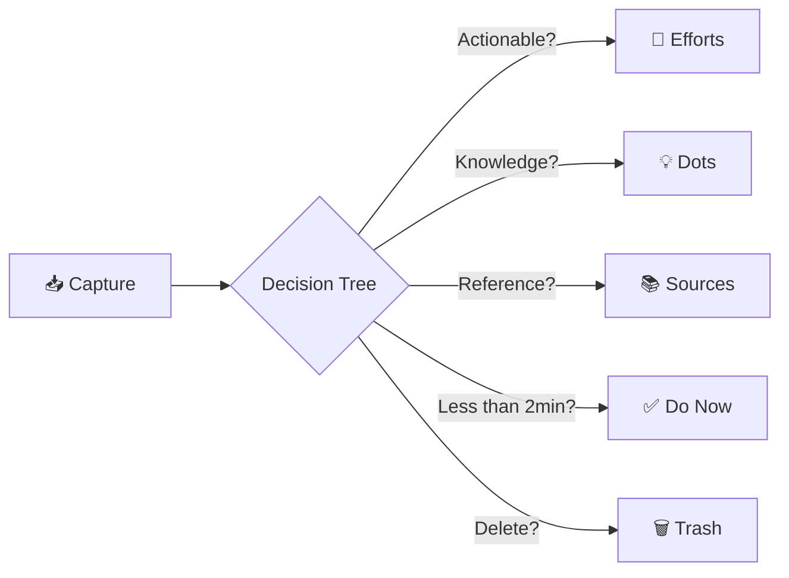

⬆️:: [[+Inbox|+Inbox]]
![[zettelkasten-workflow.png]]
# About Inbox 📥

> [!tip]+ **⚡ Quick Reference**
> **What**: Your capture gateway - the first stop for all new ideas, notes, and content  
> **Why**: Frictionless capture without organizational overhead prevents lost ideas  
> **How**: Capture → Process → Organize → Clear  
> **When**: Capture anytime, process daily (10 minutes)  
> **Success**: Inbox stays under 20 items, processed within 24-48 hours

---

## 🎯 What Inbox Is

The Inbox is your **friction-free capture zone** - a temporary holding space for everything that enters your vault before it gets properly organized. Think of it as the front door to your knowledge system.

**Not a storage location** - Items shouldn't live here permanently  
**Not a dumping ground** - Everything captured should eventually be processed

---

## 📦 What Goes Into Inbox

### **Quick Captures**
- Fleeting thoughts and ideas
- Voice memos transcribed on mobile
- Quick meeting notes
- Screenshots with context
- Web clips and highlights
- Task reminders
- Questions to explore later

### **Unprocessed Content**
- New sources before full processing
- Draft atomic notes needing development
- Project ideas requiring clarification
- Half-formed concepts awaiting structure

---

## 🔄 Inbox Workflow

### **Daily Processing Ritual** (10 minutes)

> [!gear]+ **📋 GTD-Inspired Processing**
> For each Inbox item, ask:
> 
> 1. **What is it?** - Clarify the content and context
> 2. **Is it actionable?** 
>    - Yes → Move to [[03-Efforts]] or add task
>    - No → Continue to next question
> 3. **Is it reference material?** 
>    - Yes → Process to [[04-Sources]]
>    - No → Continue
> 4. **Is it a knowledge insight?**
>    - Yes → Develop into [[02-Dots]]
>    - No → Continue
> 5. **Does it take less than 2 minutes?**
>    - Yes → Do it immediately
>    - No → Schedule or defer
> 6. **Is it still relevant?**
>    - No → Delete without guilt

---

## 🧭 Where Items Go After Processing

| Item Type | Destination | Template | Next Action |
|-----------|------------|----------|-------------|
| **Project idea** | `03-Efforts` | Effort Template | Define scope & next steps |
| **Knowledge insight** | `02-Dots` | Atomic/Dot Template | Add connections & evidence |
| **External content** | `04-Sources` | Source Template | Process and extract value |
| **Person contact** | `02-Dots/300-People` | Person Template | Add relationship context |
| **Quick task** | Daily Note or Effort | Task format | Complete or schedule |
| **Meeting notes** | `04-Sources/Meetings` | Meeting Template | Extract actions & insights |

---

## 🩺 Inbox Health Diagnostics

### **🔴 Red Flags - Clean Up Immediately**

> [!danger]+ **Inbox Problems**
> - ❌ **20+ items** sitting unprocessed for 3+ days
> - ❌ **Items older than 1 week** without processing
> - ❌ **No daily processing** for 3+ consecutive days
> - ❌ **Using Inbox as permanent storage** instead of temporary holding
> - ❌ **Decision paralysis** - same items reviewed but never moved

### **🟡 Yellow Warnings - Improve Habits**

> [!warning]+ **Inbox Friction Points**
> - ⚠️ **10-20 items** - manageable but needs attention
> - ⚠️ **Processing takes too long** - oversized content or unclear templates
> - ⚠️ **Captured items lack context** - hard to understand later
> - ⚠️ **Avoiding specific types** of captures consistently
> - ⚠️ **Irregular processing rhythm** - sometimes daily, sometimes weekly

### **🟢 Green Health Indicators**

> [!success]+ **Optimal Inbox Flow**
> - ✅ **Under 10 items** at any given time
> - ✅ **Daily processing habit** of 5-10 minutes
> - ✅ **Quick, guilt-free decisions** using GTD framework
> - ✅ **Clear capture templates** reducing friction
> - ✅ **Items move out within 24-48 hours**

---

## ⚡ Inbox Best Practices

### **Capture Excellence**
- **Use quick capture templates** for zero-friction input
- **Add minimal context** - enough to remember later (who/what/why)
- **Timestamp everything** automatically with templates
- **Mobile-friendly captures** for on-the-go ideas
- **Voice memo integration** for hands-free capture

### **Processing Excellence**
- **Time-box processing** to 10 minutes daily
- **Use decision tree** to avoid overthinking
- **Trust your gut** - quick decisions beat perfect decisions
- **Delete liberally** - not everything deserves processing
- **Batch similar items** when moving to destinations

### **Maintenance Excellence**
- **"Inbox Zero" mindset** - empty isn't required, but aim for minimal
- **Weekly inbox audit** - review anything older than 3 days
- **Monthly inbox reset** - ensure nothing is permanently stuck
- **Track inbox metrics** - average items, processing time, oldest item

