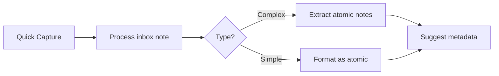

# Claude Skills for PKM

A guide to leveraging Claude AI effectively within your Personal Knowledge Management system.

---

## Available Claude Prompts

These Copilot prompts are designed specifically for PKM workflows:

### Processing & Capture

| Prompt | Purpose | When to Use |
|--------|---------|-------------|
| **Process inbox note** | Classify, extract, and suggest next steps | Fresh captures in +Inbox |
| **Extract atomic notes** | Break content into standalone concepts | Dense sources, meeting notes |
| **Suggest metadata** | Generate YAML frontmatter | Any note needing metadata |

### Connection & Structure

| Prompt | Purpose | When to Use |
|--------|---------|-------------|
| **Find connections** | Discover implicit links between ideas | Any note needing context |
| **Create MOC structure** | Build navigation for a topic area | Starting a new knowledge domain |
| **Format as atomic** | Transform into proper atomic note format | Raw captures ready for processing |

### Review & Maintenance

| Prompt | Purpose | When to Use |
|--------|---------|-------------|
| **Assess note maturity** | Evaluate seed → evergreen progression | Weekly reviews |
| **Weekly review helper** | Analyze note status and relevance | Scheduled reviews |
| **Challenge this idea** | Devil's advocate analysis | Testing assumptions |

### Task Management

| Prompt | Purpose | When to Use |
|--------|---------|-------------|
| **Extract tasks** | Convert content to actionable items | Meeting notes, brainstorms |
| **Summarize meeting** | Create structured meeting note | Post-meeting processing |

### Thinking Tools

| Prompt | Purpose | When to Use |
|--------|---------|-------------|
| **Generate questions** | Socratic exploration of ideas | Deepening understanding |

---

## Prompt Engineering Techniques

### The CRAFT Framework

When customizing prompts, use:

- **C**ontext: Tell Claude about your PKM system and note type
- **R**ole: Assign expertise (PKM expert, editor, analyst)
- **A**ction: Be specific about what to do
- **F**ormat: Specify output structure (markdown, bullets, YAML)
- **T**one: Match your vault's style

### Effective Patterns

**1. Chain of Thought**
```
First analyze X, then based on that analysis, do Y...
```

**2. Structured Output**
```
Return as:
## Section 1
[content]
## Section 2
[content]
```

**3. Role Assignment**
```
You are a PKM expert who understands atomic notes and MOCs...
```

**4. Examples**
```
Format like this example:
- [[Note]] - one sentence description
```

---

## Workflow Integration

### Daily Capture Workflow



### Weekly Review Workflow

1. Run **Weekly review helper** on active notes
2. Use **Assess note maturity** on seedlings
3. Apply **Find connections** to orphan notes
4. Run **Challenge this idea** on key beliefs

### Source Processing Workflow

1. Capture source to +Inbox
2. Run **Extract atomic notes**
3. For each concept: **Format as atomic**
4. Use **Find connections** to link
5. Apply **Create MOC structure** if 5+ related notes

---

## Best Practices

### Do

- Use Claude to **augment**, not replace, your thinking
- Review and edit Claude's suggestions
- Maintain your voice in final notes
- Use prompts consistently for similar tasks
- Iterate on prompts that work well

### Don't

- Accept outputs without review
- Let Claude determine what's important to you
- Over-automate personal reflection
- Forget to add your own insights

### Quality Checks

After Claude processes a note:

- [ ] Does it match my understanding?
- [ ] Are the connections meaningful?
- [ ] Is the format consistent with my system?
- [ ] Did I add my own perspective?

---

## Customization Tips

### Adapting Prompts

1. Copy an existing prompt in `99-System/copilot-custom-prompts/`
2. Modify the instruction text
3. Test on several notes
4. Iterate based on results

### Context Injection

For better results, include vault context:

```
My PKM uses:
- Atomic notes in 02-Dots/100-Atomics
- Emoji status: 📥inbox → 🔄active → ✅completed
- Maturity: 📤seed → 🌱seedling → 🪴sapling → 🌲evergreen
```

### Bilingual Support

Add language switching:

```
Respond in [English/Czech] matching the input language.
```

---

## Troubleshooting

### Output Too Long

Add: "Be concise. Maximum 200 words."

### Wrong Format

Add explicit structure: "Use exactly this format: ..."

### Missing Context

Include more background about your vault structure.

### Generic Results

Add: "Be specific to this content, not generic advice."

---

## Related

- [[🗺️My PKM MOC]] - Main PKM index
- [[🔁My PKM Workflows]] - Standard workflows
- [[🔢My PKM Metadata]] - Metadata schema reference

---

*Document Status: 🌱 Seedling | Last Updated: 2025-01-23*
