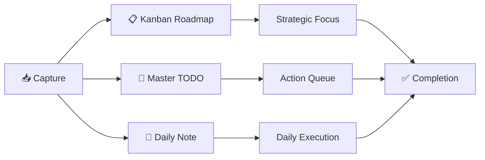
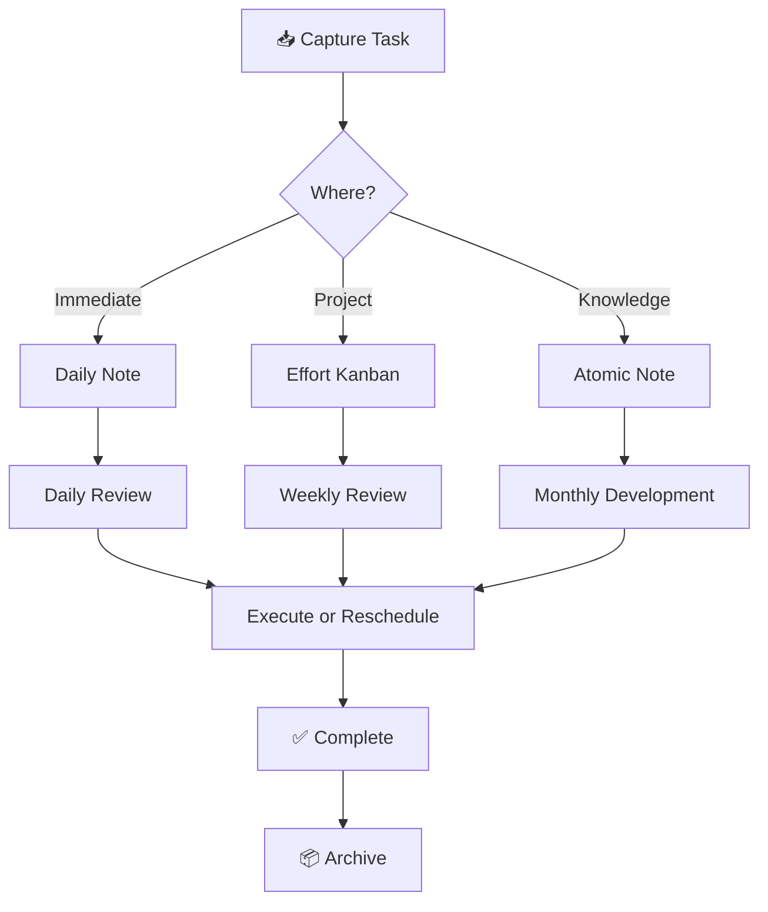

> [!orbit] Wayfinder | [[🗺️My PKM MOC]] | [[🏛️My PKM Governance]] | [[🔢My PKM Metadata]] | [[🔍My PKM Queries]] |  [[📁My PKM Folders]] |  [[🏷️My PKM Tags]] |  [[🔁My PKM Workflows]] | ✅My PKM Tasks | [[ℹ️My PKM Naming Convention]]

⬆️:: [[🏡Home]]
# ✅ PKM Tasks System

> [!info]+ **⚡ Tasks Overview**
> **Purpose**: Unified task management integrated with PKM workflow  
> **Philosophy**: Capture fast, organize smart, execute with focus  
> **Core Tools**: Tasks Plugin + Kanban + QuickAdd + Daily Notes  
> **Success**: Clear next actions, zero friction, visible progress

# TL;DR rules

1. **Capture** everything as a plain Tasks-plugin checkbox.
2. **Where it lives** depends on _intent_:
    - **Do today?** → in today’s **Daily note**.
    - **Belongs to a project/area?** → inside that **Effort note** (or its checklist section).
    - **General Obsidian improvements / ideas (not urgent)?** → in a central **Backlog note** (or the relevant MOC) with a tag like `#🧹tidy` or `#🌱develop`.
3. **Roadmap Kanban** = only your **high-level initiatives** (Epics). Each card links to a note (Effort/MOC). Individual tasks stay in notes, not on the board.

---

## 🎯 Task Management Philosophy



### **Three-Layer System**

> [!success]+ **Task Architecture**
> 1. **📋 Kanban ≈ Roadmap** → Strategic focus at a glance
> 2. **📝 Master TODO ≈ Queue** → Centralized action list
> 3. **📅 Daily Note ≈ Inbox** → Fast capture, nightly clearing

---

## 🏗️ System Architecture

### **Core Task Engine**

| Tool | Purpose | Use Case | Priority |
|------|---------|----------|----------|
| **Tasks Plugin** | Task engine | Creating, tracking, querying tasks | 🔴 Essential |
| **Kanban Plugin** | Visual workflow | Project boards and status tracking | 🟡 High Value |
| **QuickAdd** | Fast capture | Instant task creation with templates | 🟡 High Value |
| **Templater** | Automation | Consistent task templates | 🟢 Nice-to-Have |
| **Dataview** | Analytics | Task reporting and dashboards | 🟢 Nice-to-Have |

### **Optional Integrations**

| Integration | Purpose | Best For |
|-------------|---------|----------|
| **Todoist Sync** | External sync | Mobile access outside Obsidian |
| **Morgen Tasks** | Calendar integration | Time blocking and scheduling |
| **Tasks Timeline** | Gantt view | Project timelines |

---

## 📁 Folder-Based Task Mapping

```

📂 Vault Structure        Task Type             Management Style
├── +Inbox           → Quick capture        QuickAdd + Tasks
├── 02-Dots            → Idea tasks          Lightweight checkboxes
├── 03-Efforts         → Project boards      Kanban + Tasks queries
├── 04-Sources         → Research tasks      Reading/processing lists
├── 05-Calendar        → Daily/weekly        Task dashboards
├── 06-Archive         → Completed           Automated archival
└── 99-System          → Templates           Task automation

```

---

## ✅ Task Syntax & Symbols

### **Obsidian Tasks Syntax**

```

- [ ] Task description 📅 2025-10-15 ⏫ \#context/work

```

### **Key Symbols Reference**

| Symbol | Name | Purpose | Example |
|--------|------|---------|---------|
| `📅` | Due date | Deadline for completion | `📅 2025-10-15` |
| `⏰` | Scheduled | When to work on it | `⏰ 2025-10-10` |
| `🛫` | Start date | Earliest start time | `🛫 2025-10-01` |
| `✅` | Done date | Completion timestamp | Auto-added |
| `🔁` | Recurrence | Repeating tasks | `🔁 every week` |
| `⏫` | High priority | Critical importance | `⏫` |
| `🔼` | Medium priority | Standard importance | `🔼` |
| `🔽` | Low priority | Nice to have | `🔽` |
| `🆔` | Task ID | Unique identifier | Auto-generated |

### **Priority Levels**

| Symbol | Priority | Use When | Query Sorting |
|--------|----------|----------|---------------|
| `⏫` | Highest | Mission-critical, urgent | First |
| `🔼` | High | Important, time-sensitive | Second |
| (none) | Normal | Standard work | Third |
| `🔽` | Low | Nice-to-have, filler tasks | Last |

---

## 📋 Task Creation Methods

### **1. Quick Capture** (Fastest)

**Method**: QuickAdd Hotkey  
**Speed**: ⚡⚡⚡ Instant  
**Use**: Capturing fleeting tasks without breaking flow

**Setup**:
- Hotkey: `Ctrl+Shift+T` (or custom)
- Template: Pre-filled metadata
- Destination: Daily Note or Inbox

**Example Output**:
```

- [ ] Call doctor for appointment 📅 2025-10-02 \#context/calls

```

---

### **2. Inline Task** (Standard)

**Method**: Type directly in note  
**Speed**: ⚡⚡ Fast  
**Use**: Tasks embedded in project notes

**Format**:
```


## Next Actions

- [ ] Review PR \#123 📅 2025-10-01 ⏫ \#context/work
- [ ] Update documentation 📅 2025-10-03 \#context/computer
- [ ] Schedule team meeting ⏰ 2025-10-02 \#context/calls

```

---

### **3. Daily Note Task** (GTD Inbox)

**Method**: Add to Daily Note during the day  
**Speed**: ⚡⚡⚡ Immediate  
**Use**: Capturing tasks as they arise

**Daily Note Section**:
```


## Tasks Captured Today

- [ ] Fix bug in login flow 📅 2025-10-01 ⏫
- [ ] Buy groceries 📅 2025-10-01 \#context/errands
- [ ] Read chapter 3 of PKM book 📅 2025-10-02 \#energy/low


## Tasks for Today

[Tasks query showing today's due items]

```

---

### **4. Kanban Card** (Project View)

**Method**: Drag & drop on Kanban board  
**Speed**: ⚡ Visual  
**Use**: Project workflow management

**Kanban Setup**:
```


## Backlog

- [ ] Research feature A
- [ ] Design mockup


## In Progress

- [ ] Develop feature B 📅 2025-10-05 ⏫


## Review

- [ ] Test feature C ⏰ 2025-10-02


## Done

- [x] Complete feature D ✅ 2025-09-28

```

---

## 🎨 Kanban Board Templates

### **Development Project Board**

| Column | Purpose | Task Status |
|--------|---------|-------------|
| **Backlog** | Ideas & future work | Not started |
| **To Do** | Prioritized next | Ready to start |
| **In Progress** | Active work | Working now |
| **Testing** | QA phase | Under review |
| **Deploy** | Ready to ship | Final stage |
| **Done** | Completed | Archived |

---

### **Content Creation Board**

| Column | Purpose | Task Status |
|--------|---------|-------------|
| **Ideas** | Raw concepts | Brainstorming |
| **Research** | Gathering info | Investigation |
| **Drafting** | Writing phase | Active creation |
| **Review** | Editing | Refinement |
| **Published** | Live content | Complete |

---

### **Administrative Board**

| Column | Purpose | Task Status |
|--------|---------|-------------|
| **Inbox** | New items | Unprocessed |
| **Planning** | Organizing | Structuring |
| **Action** | Executing | Working |
| **Waiting** | Blocked | Paused |
| **Completed** | Done | Archived |

---

## 🔍 Essential Task Queries

### **1. Today's Focus** ⭐ Most Important

```

not done
(due today) OR (scheduled today)
sort by priority desc, due
limit 5

```

**Purpose**: Morning planning - what matters today  
**Location**: Dashboard, Daily Note header

---

### **2. Overdue & Urgent** 🔴 Crisis Management

```

not done
due before today
sort by due, priority desc

```

**Purpose**: Catch fallen-through tasks  
**Review**: Daily morning review

---

### **3. This Week's Deadlines** 📅 Weekly Planning

```

not done
due before next week
sort by due asc

```

**Purpose**: Weekly review and planning  
**Review**: Sunday evening or Monday morning

---

### **4. Waiting For** ⏳ GTD Follow-up

```

not done
description includes waiting

```

**Purpose**: Track blocked or delegated items  
**Review**: Weekly review

---

### **5. High Priority Active** ⏫ Critical Work

```

not done
priority is high
sort by due

```

**Purpose**: Focus on most important work  
**Review**: Daily

---

### **6. Context-Based Lists** 🏷️ Energy Management

**Computer Work** (High Energy):
```

not done
tags include \#context/computer
tags include \#energy/high
sort by priority desc

```

**Quick Wins** (Low Energy):
```

not done
tags include \#quick-win
sort by priority desc
limit 10

```

**Errands** (Batch Processing):
```

not done
tags include \#context/errands
sort by due

```

---

### **7. Project Overview** 📊 Portfolio View

```

not done
path includes 03-Efforts
group by filename
sort by priority desc

```

**Purpose**: See all tasks by project  
**Review**: Weekly review

---

### **8. Completed This Week** ✅ Wins Tracking

```

done this week
group by done

```

**Purpose**: Celebrate progress  
**Review**: Friday afternoon or Sunday evening

---

## 📊 Advanced Dataview Queries

### **Weekly Task Dashboard**

```

TABLE
text as "Task",
due as "Due",
priority as "Priority",
choice(due < date(today), "🔴 Overdue",
due = date(today), "🟡 Today",
due = date(today) + dur(1 day), "🟠 Tomorrow",
"🔵 Upcoming") as "Status"
FROM ""
WHERE !completed AND due <= date(today) + dur(7 days)
SORT due asc, priority desc

```

---

### **Task Health Metrics**

```

const allTasks = dv.pages().file.tasks;
const completed = allTasks.where(t => t.completed);
const incomplete = allTasks.where(t => !t.completed);
const overdue = incomplete.where(t => t.due \&\& t.due < dv.date("today"));

dv.paragraph(`
📊 **Task Health Metrics**

- Total Tasks: \${allTasks.length}
- ✅ Completed: ${completed.length} (${Math.round(completed.length/allTasks.length*100)}%)
- 🔄 Active: \${incomplete.length}
- 🔴 Overdue: \${overdue.length}
`);

```

---

### **Project Task Breakdown**

```

TABLE
length(rows) as "Task Count",
length(filter(rows.file.tasks, (t) => t.completed)) as "✅ Done",
length(filter(rows.file.tasks, (t) => !t.completed)) as "🔄 Active"
FROM "03-Efforts"
WHERE type = "effort"
GROUP BY file.link
SORT length(rows.file.tasks) DESC

```

---

## 🔄 Daily Task Workflow

### **Morning Routine** ☀️ (10 minutes)

```

1. [ ] Open Dashboard
2. [ ] Review "Today's Focus" query
3. [ ] Check for overdue tasks
4. [ ] Identify 3 Most Important Tasks (MITs)
5. [ ] Schedule high-energy tasks for morning
6. [ ] Review calendar for time blocks
7. [ ] Start first MIT
```

### **Throughout the Day** 🏃 (Continuous)

- Capture tasks to Daily Note instantly
- Check off completed items immediately
- Add context and priority tags as needed
- Move tasks between Kanban columns
- Update next actions for stalled work

### **Evening Review** 🌙 (5 minutes)

```

1. [ ] Complete remaining tasks or reschedule
2. [ ] Clear Daily Note inbox
3. [ ] Celebrate wins (completed tasks)
4. [ ] Move undone tasks to appropriate notes
5. [ ] Plan tomorrow's top 3 priorities
6. [ ] Archive completed work
```

---

## 📅 Weekly Task Workflow

### **Weekly Review** (30-45 minutes)

**Sunday Evening or Monday Morning**:

```


## 1. Clear Completed (10 min)

- [ ] Run "Completed This Week" query
- [ ] Archive finished tasks
- [ ] Update project statuses


## 2. Review Active Work (15 min)

- [ ] Check all active projects (Kanban boards)
- [ ] Update priorities
- [ ] Identify blocked tasks → add to "Waiting For"
- [ ] Reschedule overdue items


## 3. Process Development Pipeline (10 min)

- [ ] Review \#🌱develop tasks
- [ ] Check \#❔question research items
- [ ] Clean up \#🧹tidy tasks


## 4. Plan Next Week (10 min)

- [ ] Set weekly goals
- [ ] Schedule high-priority tasks
- [ ] Batch similar contexts (calls, errands)
- [ ] Time block focus work

```

---

## 🎯 Task Best Practices

### **Do's ✅**

- ✅ Capture tasks immediately (Daily Note or QuickAdd)
- ✅ Use due dates sparingly (only real deadlines)
- ✅ Use scheduled dates for planning (when to work on it)
- ✅ Add context tags for energy/location matching
- ✅ Review tasks daily (morning planning)
- ✅ Clear completed tasks weekly
- ✅ Use Kanban for visual project tracking
- ✅ Batch similar tasks by context
- ✅ Time-box task reviews (don't over-plan)

### **Don'ts ❌**

- ❌ Create tasks you won't actually do
- ❌ Add fake due dates (creates task fatigue)
- ❌ Over-prioritize (not everything is urgent)
- ❌ Let overdue tasks pile up (reschedule or delete)
- ❌ Skip daily review (tasks get stale)
- ❌ Use tasks for knowledge notes (use atomics instead)
- ❌ Create duplicate tasks across notes
- ❌ Forget to celebrate completed work

---

## 🧩 Task Integration with PKM

### **Tasks in Different Note Types**

| Note Type | Task Use | Example |
|-----------|----------|---------|
| **Daily Note** | Capture inbox | Quick todos for the day |
| **Effort (Project)** | Next actions | Project-specific tasks |
| **Atomic (Knowledge)** | Development todos | Research questions, expansions |
| **Source** | Reading tasks | Chapters to read, notes to extract |
| **MOC** | Topic development | Areas to explore, links to add |
| **Meeting** | Action items | Follow-ups, decisions to implement |

---

### **From Capture to Completion**



---

## 🛠️ Task Automation

### **QuickAdd Macro** (Fast Task Creation)

```

// Quick Task Capture to Daily Note
const moment = require('moment');
const today = moment().format('YYYY-MM-DD');
const dailyNote = `05-Calendar/Daily/${today}.md`;

// Prompt for task details
const task = await this.quickAddApi.inputPrompt("Task:");
const priority = await this.quickAddApi.suggester(
["⏫ High", "🔼 Medium", "Normal", "🔽 Low"],
["⏫", "🔼", "", "🔽"]
);
const context = await this.quickAddApi.suggester(
["Work", "Home", "Computer", "Calls", "Errands"],
["\#context/work", "\#context/home", "\#context/computer", "\#context/calls", "\#context/errands"]
);

// Create task string
const taskString = `- [ ] ${task} 📅 ${today} ${priority} ${context}`;

// Append to Daily Note
await this.app.vault.adapter.append(dailyNote, `\n${taskString}`);

```

---

### **Templater Auto-Task** (Project Templates)

```


## Next Actions

- [ ] Define project scope 📅 <% tp.date.now("YYYY-MM-DD", 3) %> ⏫
- [ ] Break down into milestones ⏰ <% tp.date.now("YYYY-MM-DD", 7) %>
- [ ] Identify key stakeholders

```

---

## 🩺 Task Health Monitoring

### **Task System Health Indicators**

| Indicator | Healthy | Warning | Critical |
|-----------|---------|---------|----------|
| **Overdue tasks** | 0-2 | 3-5 | 6+ |
| **Daily capture** | 5-15 | 15-25 | 25+ |
| **Completion rate** | >70% | 50-70% | <50% |
| **Oldest active task** | <7 days | 7-14 days | 14+ days |
| **Waiting for items** | Clear owner | Vague | Forgotten |

### **Monthly Task Audit**

```


## Task System Review Checklist

- [ ] Run overdue task query → reschedule or delete
- [ ] Check oldest active tasks → complete or archive
- [ ] Review "Waiting For" list → follow up
- [ ] Prune impossible/unrealistic tasks
- [ ] Update Kanban boards → archive completed columns
- [ ] Celebrate completion rate
- [ ] Adjust capture methods if needed

```

---

## 🚀 Getting Started with Tasks

### **Week 1: Foundation**
- [ ] Install Tasks plugin
- [ ] Install Kanban plugin (optional)
- [ ] Set up QuickAdd hotkey for fast capture
- [ ] Add task section to Daily Note template
- [ ] Practice capturing 5+ tasks daily

### **Week 2-4: Habit Building**
- [ ] Daily morning task review (10 min)
- [ ] Use priority and context tags
- [ ] Complete first weekly review
- [ ] Create first project Kanban board
- [ ] Run task queries in Dashboard

### **Month 2+: Mastery**
- [ ] Optimize capture methods (reduce friction)
- [ ] Refine context tags for your lifestyle
- [ ] Build custom task queries
- [ ] Integrate with calendar/time blocking
- [ ] Automate task archival

---

## 🔗 Related System Notes

- [[🔁My PKM Workflows]] - How tasks integrate with PKM flow
- [[🔢My PKM Metadata]] - Task metadata standards
- [[🏷️My PKM Tags]] - Context and priority tagging
- [[👁️Dashboard]] - Task dashboards and queries
- [[05-Calendar]] - Daily and weekly task planning

---

> [!quote]+ **💭 Task Philosophy**
> *"Tasks are commitments to future action. Capture liberally, execute strategically, review regularly. A task system should reduce cognitive load, not add to it. If a task sits undone for weeks, delete it or transform it into knowledge work."*

---

*Last Updated: 2025-10-01 | Review: Monthly | Status: 🟢 Active & Optimized*

## **Key Features:**

### **✅ Complete System**

- **3-layer architecture** (Kanban/TODO/Daily)
- **6 task creation methods** with speed ratings
- **8 essential queries** for daily use
- **3 Kanban templates** for different project types


### **🎨 Visual Excellence**

- **Mermaid workflow** diagrams
- **Symbol reference** tables
- **Priority matrix** visualization
- **Health indicator** scorecard


### **🤖 Practical Automation**

- **QuickAdd macros** for instant capture
- **Templater scripts** for project tasks
- **Dataview queries** for dashboards
- **Health monitoring** metrics


### **📋 Actionable Structure**

- **Daily/weekly workflows** with checklists
- **Best practices** (Do's and Don'ts)
- **Getting started** roadmap
- **Integration guide** with PKM system

This creates a complete, visual, and immediately actionable task management system fully integrated with your PKM workflow! ✅✨


