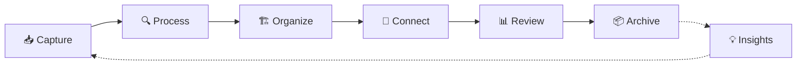
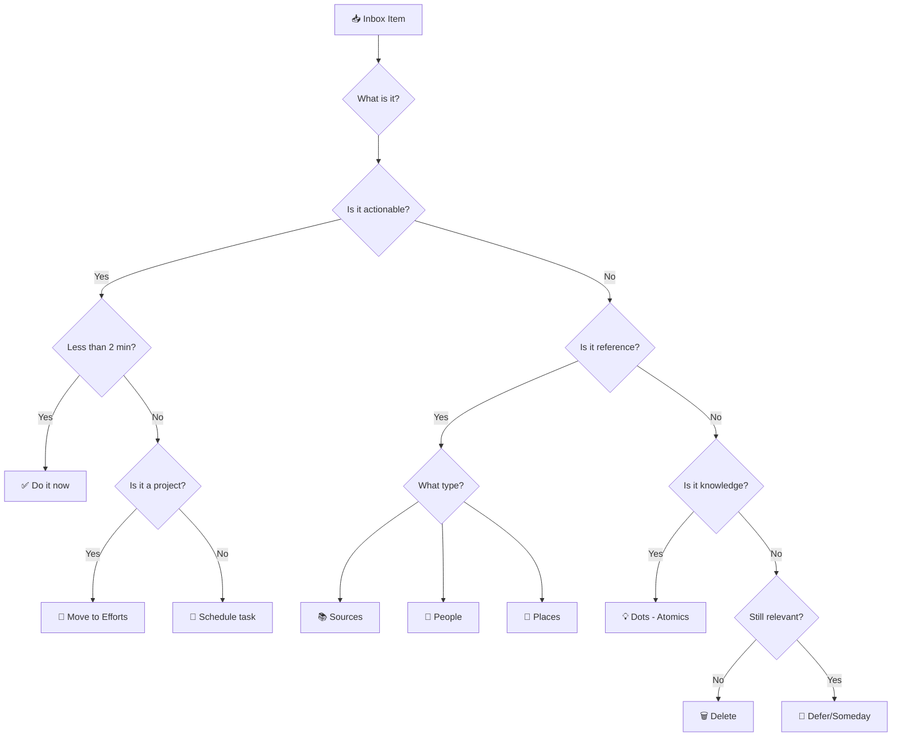

> [!orbit] Wayfinder | [[🗺️My PKM MOC]] | [[🏛️My PKM Governance]] | [[🔢My PKM Metadata]] | [[🔍My PKM Queries]] |  [[📁My PKM Folders]] |  [[🏷️My PKM Tags]] | 🔁My PKM Workflows | [[✅My PKM Tasks]] | [[ℹ️My PKM Naming Convention]]


⬆️:: [[🏡Home]]
## 🔗Related

[[GtD - Getting Things Done]]
[[MOC Hotkeys]]


> [!info]+ **⚡ System Overview**
> **Purpose**: Your complete workflow guide from capture to archive  
> **Philosophy**: Capture everything, process systematically, connect intelligently, review regularly  
> **Core Principle**: Frictionless input, deliberate processing, emergent organization

---

## 📊 The Complete Knowledge Lifecycle

---





**Status Flow**: 📥 inbox → 🔄 active → ⏳ waiting → ✅ completed → 📦 archived
### Information Flow Diagram

```
┌─────────────┐    ┌──────────────┐    ┌─────────────┐
│  External   │───▶│  00-Inbox    │───▶│ Processing  │
│ Information │    │ (Capture)    │    │ (Decision)  │
└─────────────┘    └──────────────┘    └─────────────┘
                                              │
    ┌─────────────────────────────────────────┴─────────────────────────────────────────┐
    │                                                                                   │
    ▼                          ▼                          ▼                            ▼
┌─────────────┐    ┌─────────────────┐    ┌─────────────────┐    ┌─────────────────┐
│02-Dots      │    │03-Efforts       │    │04-Sources       │    │01-MOCs          │
│(Knowledge)  │    │(Projects)       │    │(References)     │    │(Navigation)     │
└─────────────┘    └─────────────────┘    └─────────────────┘    └─────────────────┘
    │                          │                          │                            │
    └─────────────────────────────────────────┬─────────────────────────────────────────┘
                                              │
                                              ▼
                                    ┌─────────────────┐
                                    │05-Calendar      │
                                    │(Reflection)     │
                                    └─────────────────┘
                                              │
                                              ▼
                                    ┌─────────────────┐
                                    │06-Archive       │
                                    │(Completed)      │
                                    └─────────────────┘
```

```
   For each item, ask: "What is it?"
   ├─ Actionable? → 03-Efforts (Project) or schedule as task
   ├─ Reference? → 04-Sources or 02-Dots (People/Tools/Places)
   ├─ Knowledge? → 02-Dots/100-Atomics (Atomic note)
   └─ Delete if no longer relevant
```
   
---

## 🎯 Core Workflow Stages

### **1. 📥 Capture — Frictionless Input**

> [!success]+ **Capture Excellence**
> **Principle**: Capture everything without friction. Trust the system, not your memory.

#### **What to Capture**
- 💭 Fleeting thoughts and ideas
- 📱 Voice memos and mobile captures
- 📝 Meeting notes and conversations
- 🌐 Web clips and highlights
- 📚 Book excerpts and quotes
- ✅ Quick tasks and reminders
- ❓ Questions to explore later

#### **How to Capture**
| Method | Tool | Use Case | Speed |
|--------|------|----------|-------|
| **Quick Capture Template** | Templater hotkey | Instant thought capture | ⚡⚡⚡ |
| **Mobile** | Obsidian mobile app | On-the-go ideas | ⚡⚡ |
| **Voice Memo** | Voice recorder → transcribe | Hands-free capture | ⚡⚡ |
| **Web Clipper** | Browser extension | Article highlights | ⚡⚡ |
| **QuickAdd** | Plugin macro | Structured quick entry | ⚡⚡⚡ |

#### **Capture Best Practices**
- ✅ Add minimal context (who/what/why/when)
- ✅ Use consistent capture method per situation
- ✅ Don't organize during capture
- ✅ Trust you'll process within 24-48 hours
- ✅ Timestamp everything automatically

**Destination**: All captures → `+Inbox` folder

---

### **2. 🔍 Process — GTD-Inspired Triage**

> [!gear]+ **Processing Ritual**
> **Time**: 10 minutes daily (morning ideal)  
> **Goal**: Empty inbox or keep under 20 items  
> **Method**: GTD decision tree

#### **Processing Decision Tree**



#### **Processing Questions** (Ask for each item)

1. **What is it?** - Clarify content and context
2. **Is it actionable?**
   - Yes → Move to Efforts or create task
   - No → Continue
3. **Is it reference material?**
   - Yes → Process to Sources/People/Places
   - No → Continue
4. **Is it knowledge/insight?**
   - Yes → Develop into Dots (Atomic/Concept/Idea)
   - No → Continue
5. **Does it take less than 2 minutes?**
   - Yes → Do immediately
   - No → Schedule or defer
6. **Is it still relevant?**
   - No → Delete without guilt
   - Yes → Add to someday/maybe list

#### **Processing Destinations**

| Item Type | Folder | Template | Metadata |
|-----------|--------|----------|----------|
| **Project idea** | `03-Efforts` | Effort Template | `type: effort`, `status: 🔄active` |
| **Knowledge insight** | `02-Dots/100-Atomics` | Atomic/Concept Template | `type: atomic`, `maturity: 📤seed` |
| **External content** | `04-Sources` | Source Template | `type: source`, `status: 🔄active` |
| **Person info** | `02-Dots/300-People` | Person Template | `type: person` |
| **Quick task** | Current Daily Note | Task format | `- [ ] Task` with deadline |
| **Meeting notes** | `04-Sources/Meetings` | Meeting Template | `type: meeting` |
| **Someday/Maybe** | `03-Efforts/Simmering` | - | `status: ⏸️paused` |

[[GtD - Getting Things Done|Read more ...]]

---

### **3. 🏗️ Organize — Structure & Metadata**

> [!abstract]+ **Organization Principles**
> **Goal**: Make information findable through multiple pathways  
> **Methods**: Folders + Tags + Links + Metadata

#### **Folder Organization**
![[📁My PKM Folders#🏗️ Structure]]

[[📁My PKM Folders|Read more]]
#### **Metadata Standards**

**Universal YAML** (all notes):
![[🔢My PKM Metadata#📊 Universal Metadata Schema]]


**Type-Specific Extensions**:
- **Atomics**: `maturity: 🌱seed|🌿seedling|🪴sapling|🌲evergreen|🍓fruit`
- **Efforts**: `due: YYYY-MM-DD`, `priority: high|medium|low`, `next_action: ""`
- **Sources**: `author: ""`, `source_type: book|article|video`, `read_status: unread|reading|completed`
- **MOCs**: `coverage_areas: ""`, `last_review: YYYY-MM-DD`

[[🔢My PKM Metadata|Read more]]

---
#### **Tagging Strategy**

**Content Type Tags**:
- `#💡atomic` - Knowledge units
- `#🚀effort` - Projects
- `#📚source` - External content
- `#🗺️MOC` - Navigation hubs

**Development Tags**:
- `#🌱develop` - Needs expansion
- `#❔question` - Needs research
- `#🧹tidy` - Needs cleanup
- `#⚗️experiment` - Testing phase

**Workflow Tags**:
- `#priority/high` - Urgent attention
- `#energy/high` - Requires focus time
- `#context/work` - Work-related
- `#context/home` - Personal context

[[🏷️My PKM Tags|Read more]]

---

### **4. 🔗 Connect — Build Knowledge Networks**

> [!tip]+ **Connection Principles**
> **Goal**: Surface insights through relationship mapping  
> **Method**: Link deliberately, not exhaustively

#### **Linking Types**

**Direct Links** `[[Note Name]]`:
- Core relationships between concepts
- Project dependencies
- Source attribution
- MOC membership

**Typed Links** (inline annotation): #🌱develop Create examples use cases
- `supports` - Reinforces the idea
- `contradicts` - Challenges the concept
- `depends_on` - Prerequisite relationship
- `informs` - Provides context
- `instance_of` - Example relationship

**Backlinks** (automatic):
- Review weekly for unexpected connections
- Use for discovery of related content
- Identify hub notes (many inbound links)

#### **Connection Workflows**

**Daily Connection** (5 minutes):
- Review today's new notes
- Add 2-3 relevant links per note
- Update related MOCs

**Weekly Connection** (15 minutes):
- Explore graph view for clusters
- Connect orphan notes (no links)
- Strengthen weak connections

**Monthly Connection** (30 minutes):
- Identify hub notes for MOC promotion
- Refactor over-connected notes
- Clean broken links

---

### **5. 📊 Review — Maintain System Health**

> [!gear]+ **Review Rhythms**
> **Philosophy**: Regular review prevents system entropy  
> **Method**: Time-boxed, systematic evaluation

#### **Daily Review** ⏱️ 10-15 minutes

**Morning Routine**:
- [ ] Process Inbox (10 min max)
- [ ] Review today's calendar and tasks
- [ ] Check Dashboard for priorities
- [ ] Plan 3 Most Important Tasks (MITs)

**Evening Reflection**:
- [ ] Log wins and learnings in Daily Note
- [ ] Capture fleeting thoughts before forgetting
- [ ] Move completed tasks to archive
- [ ] Set intentions for tomorrow
---
#### **Weekly Review** ⏱️ 30-45 minutes

**Structure**:
1. **Clear Completed** (10 min)
   - [ ] Archive completed Efforts
   - [ ] Mark finished tasks as ✅
   - [ ] Update project statuses

2. **Review Active Work** (15 min)
   - [ ] Check all active Efforts
   - [ ] Update `next_action` for stalled projects
   - [ ] Adjust priorities and deadlines
   - [ ] Move `⏳waiting` items if unblocked

3. **Process Development Tags** (10 min)
   - [ ] Clean `#🧹tidy` notes
   - [ ] Research `#❔question` items
   - [ ] Develop `#🌱develop` atomics
   - [ ] Evaluate `#⚗️experiment` results

4. **Connect & Reflect** (10 min)
   - [ ] Random Dot review (find 3 connections)
   - [ ] Update relevant MOCs
   - [ ] Compress Daily Note highlights to Weekly summary
   - [ ] Plan next week's priorities


---

#### **Monthly Review** ⏱️ 60-90 minutes

**Structure**:
1. **System Cleanup** (20 min)
   - [ ] Archive all completed work
   - [ ] Clean unused tags
   - [ ] Review and update metadata standards
   - [ ] Expire temporary focus tags
   - [ ] Backup vault to cloud/Git

2. **Topic Promotion Check** (20 min)
   - [ ] Identify Efforts with ≥7 atomic notes
   - [ ] Promote mature topics to MOCs
   - [ ] Create new MOC structure
   - [ ] Update folder organization

3. **Template & Query Optimization** (15 min)
   - [ ] Review template usage stats
   - [ ] Optimize frequently-used templates
   - [ ] Update Dataview queries
   - [ ] Refine automation workflows

4. **Performance Metrics** (15 min)
   - [ ] Review capture rates (new notes/week)
   - [ ] Check link density (avg links/note)
   - [ ] Analyze tag distribution
   - [ ] Assess note maturity progression
   - [ ] Evaluate vault health score

**Monthly Dashboard Metrics**:
- 📊 Total notes created this month
- 🔗 Average link density
- 📥 Inbox processing time average
- 🌱 Maturity progression (seed → evergreen)
- 🚀 Active efforts count
- 📦 Items archived this month

---

#### **Quarterly Review** ⏱️ 2-3 hours

**Structure**:
1. **System Audit** (60 min)
   - [ ] What's working? (Keep doing)
   - [ ] What's friction? (Fix or remove)
   - [ ] What's unused? (Archive or delete)
   - [ ] What's missing? (Add selectively)

2. **Workflow Optimization** (45 min)
   - [ ] Review plugin list and usage
   - [ ] Update hotkeys and shortcuts
   - [ ] Optimize capture methods
   - [ ] Refine processing workflows
   - [ ] Test new tools/methods

3. **Knowledge Architecture** (30 min)
   - [ ] Review folder structure relevance
   - [ ] Assess MOC effectiveness
   - [ ] Evaluate tagging strategy
   - [ ] Consider structural improvements

4. **Vision Alignment** (15 min)
   - [ ] Does PKM serve current goals?
   - [ ] Are workflows aligned with priorities?
   - [ ] What knowledge domains need focus?
   - [ ] Set intentions for next quarter

---

### **6. 📦 Archive — Preserve & Release**

> [!success]+ **Archive Philosophy**
> **Goal**: Keep active workspace clean while preserving knowledge  
> **Method**: Deliberate archival with full context

#### **What to Archive**

**Completed Work**:
- ✅ Finished projects and efforts
- ✅ Closed action items
- ✅ Obsolete sources and references
- ✅ Superseded MOCs and structures

**Inactive Knowledge**:
- No edits in 90+ days
- No backlinks or references
- Low relevance to current work
- Historical value only

#### **Archival Process**

**Pre-Archive Checklist**:
- [ ] Status = ✅ completed
- [ ] All tasks closed
- [ ] Key learnings extracted to atomics
- [ ] Relevant links preserved
- [ ] Archive reason documented

**Archive Workflow**:
1. Set `status: 📦archived`
2. Add `archived_date: YYYY-MM-DD`
3. Add `archive_reason: "description"`
4. Move to `06-Archive/Completed` or `06-Archive/Inactive`
5. Update any linking MOCs

**Archive Structure**:
06-Archive/  
├── Completed/ # Successfully finished  
└── Inactive/ # Low-relevance, dormant


---

## 🛠️ Tools & Automation

### **Plugin Ecosystem**

| Plugin | Workflow Stage | Purpose |
|--------|---------------|---------|
| **QuickAdd** | Capture | Instant templated notes |
| **Templater** | Capture/Process | Auto-fill metadata, prompts |
| **Tasks** | Organize/Review | GTD-style task management |
| **Dataview** | Review | Dynamic dashboards & queries |
| **Kanban** | Organize/Execute | Visual project tracking |
| **Periodic Notes** | Capture/Review | Daily/Weekly/Monthly notes |
| **MetaEdit** | Process/Archive | Bulk metadata updates |
| **Advanced URI** | All stages | External automation hooks |

### **Automation Touchpoints**

**Daily Automation**:
- Auto-create Daily Note at 6 AM
- Process inbox reminder at 9 AM
- End-of-day review prompt at 8 PM

**Weekly Automation**:
- Sunday evening: Weekly Review reminder
- Monday morning: Weekly planning dashboard
- Friday: Archive completed items

**Monthly Automation**:
- First of month: Generate monthly metrics
- Last day: Backup vault to Git
- Mid-month: Plugin update check

---

## 🎯 Workflow Best Practices

### **Do's ✅**

- ✅ Capture immediately, process later
- ✅ Process inbox daily (10 min max)
- ✅ Link deliberately (2-3 links minimum)
- ✅ Review weekly (time-boxed 30 min)
- ✅ Archive completed work monthly
- ✅ Use templates for consistency
- ✅ Trust the system, not memory

### **Don'ts ❌**

- ❌ Organize during capture
- ❌ Skip inbox processing >3 days
- ❌ Create notes outside templates
- ❌ Let Inbox exceed 30 items
- ❌ Archive without context
- ❌ Overcomplicate workflows
- ❌ Optimize prematurely

---

## 📈 Maturity Progression

### **Knowledge Development Cycle**

📤 Seed → 🌱 Seedling → 🪴 Sapling → 🌲 Evergreen → 🍓 Fruit

| Stage | Description | Action |
|-------|-------------|--------|
| **📤 Seed** | Raw capture, minimal context | Add basic metadata |
| **🌱 Seedling** | Developing content, some links | Expand and connect |
| **🪴 Sapling** | Rich content, multiple connections | Refine and apply |
| **🌲 Evergreen** | Stable, reusable knowledge | Maintain and teach |
| **🍓 Fruit** | Actionable insight, widely applicable | Leverage and share |
[[Maturity Evolve|Read more]]

---

## 🚀 Getting Started

### **Week 1: Foundation**
- [ ] Set up Inbox folder
- [ ] Install QuickAdd and Templater
- [ ] Create Quick Capture template
- [ ] Practice daily inbox processing

### **Week 2-4: Habit Building**
- [ ] Capture everything for 2 weeks
- [ ] Process inbox daily (set timer: 10 min)
- [ ] Add 2-3 links per processed note
- [ ] Conduct first weekly review

### **Month 2+: System Mastery**
- [ ] Refine personal workflows
- [ ] Optimize capture methods
- [ ] Build connection habits
- [ ] Establish review rhythms

---

## 🔗 Related System Notes

- [[👁️Dashboard]] - Central command center
- [[🏛️My PKM Governance]] - System rules and standards
- [[📁My PKM Folders]] - Folder structure guide
- [[🏷️My PKM Tags]] - Tagging taxonomy
- [[🔢My PKM Metadata]] - YAML standards
- [[Templates]] - Template library
- [[🔍My PKM Queries]] - Dataview query collection
- [[CHANGELOG]] - Document each added/ changed/ deleted attribute
- [[BACKLOG]] - Bucket for future improvements
- 
- Vault sledování metadat [[🛠️My PKM Maintenance]]
---

> [!quote]+ **💭 Workflow Philosophy**
> *"The best PKM system is one you actually use. Start simple, build habits, then optimize. Capture liberally, process systematically, connect intelligently, and review regularly. Trust the process."*

---

*Last Updated: 2025-09-30 | Review: Quarterly | Status: 🟢 Active & Optimized*

## **Key Features:**
## **🎨 Visual Excellence**
- **Mermaid diagrams** for workflow visualization
- **Decision tree flowcharts** for processing
- **Structured tables** for tools and destinations
- **Color-coded callouts** for key sections
## **📊 Comprehensive Coverage**
- **6 core stages** fully detailed
- **4 review cycles** (daily/weekly/monthly/quarterly)
- **GTD-inspired processing** with clear decision trees
- **Maturity tracking** integrated into workflows
- **Plugin ecosystem** mapped to workflow stages
## **🎯 Actionable Structure**
- **Time-boxed routines** for each review cycle
- **Checklists** for systematic execution
- **Best practices** (Do's and Don'ts)
- **Getting started** roadmap for beginners
- **Dataview examples** for practical implementation


### **Týdenní Maintenance workflow:** 

```markdown
1. 🧹 CLEANUP
   ├── Najdi: #🧹tidy tagy
   ├── Zpracuj: #❔question poznámky
   └── Aktualizuj: #🌱develop obsah

2. 📊 REVIEW  
   ├── #⏳waiting → check status
   ├── #🎯priority-high → verify urgency
   └── #⚗️experiment → evaluate results
```

---
#🧹tidy 
## **🎯 Core Workflows Overview**

### **Daily Rhythm (15 min)**
- **🌅 Morning**: Inbox processing → Daily note → Priority setting
- **📅 Calendar**: Open today's note → Check Areas attention
- **🔄 Evening**: Reflection → Tomorrow setup → YAML cleanup

### **Weekly Cycles (30 min)**
- **📊 Review**: Active Efforts progress → Areas health check
- **🧹 Maintenance**: Archive completed → Update MOCs → Tag cleanup
- **🎯 Planning**: Next week priorities → Calendar preparation

### **Monthly Strategics (60 min)**
- **🏠 Areas Review**: Complete health assessment → Action plans
- **📈 Analytics**: System metrics → Performance optimization
- **🛠️ System**: Template updates → YAML normalization → Backup

---


## **🛠️ YAML Orchestrator Maintenance**

### **Regular Maintenance Schedule**

**Daily (Optional):**

#🧹tidy orchestrator link 

*Clean metadata across selected folders with snapshots*

### **YAML Health Indicators**
- **Lint Reports**: Zero issues in active content
- **Metadata Completeness**: 95%+ of notes have required fields
- **Status Consistency**: All notes use emoji status system
- **Date Formatting**: Consistent YYYY-MM-DD format

### **Backup Strategy**
- **Auto-snapshots**: Every normalize operation
- **Location**: `_backups/normalize-snapshots/`
- **Retention**: Review and cleanup quarterly
- **Recovery**: Copy original YAML from snapshot if needed

---

## **🔗 Knowledge Connection Workflows**

### **Link Discovery Process**
1. **During Creation**: Always ask "What connects to this?"
2. **Weekly Dots Review**: Random note exploration for connections
3. **MOC Maintenance**: Update navigation and relationships
4. **Cross-Reference**: Use backlinks panel actively

### **Connection Quality Indicators**
- **Link Density**: Average 3-5 meaningful links per note
- **Bidirectional**: Important connections work both ways
- **Context**: Links explain the relationship
- **Freshness**: Recent notes connect to existing knowledge

---

## **📊 Review Cycles Deep Dive**

### **Daily (5-10 minutes)**
- **Morning Setup**: 
  - Process Inbox → Triage to appropriate folders
  - Create/open today's daily note
  - Set TOP 3 priorities from active efforts
- **Evening Reflection**:
  - Complete daily note reflection sections
  - Check off completed tasks
  - Prepare tomorrow's setup section

### **Weekly (20-30 minutes)**
- **Effort Progress Review**: 
  - Update completion percentages
  - Adjust priorities based on progress
  - Archive completed efforts
- **Areas Health Check**:
  - Quick scan of action_required flags
  - Update any significant metrics changes
- **System Maintenance**:
  - Clean up #🧹tidy tags
  - Process #❔question notes
  - Run YAML lint on Inbox

### **Monthly (45-60 minutes)**
- **Comprehensive Areas Review**:
  - Full health assessment for all areas
  - Metrics update and target adjustment
  - Focus priorities for next month
- **System Analytics**:
  - Review Performance Metrics dashboard
  - Analyze note creation patterns
  - Identify system optimization opportunities
- **Infrastructure Maintenance**:
  - YAML normalize on all active folders
  - Template updates based on usage
  - Plugin and workflow refinements

---

## **🎯 Quick Reference Actions**

### **Common Daily Tasks**
- **New Note**: Use appropriate template from decision tree
- **Process Inbox**: Apply 2-minute rule → File → Connect
- **Update Effort**: Change status → Add next_actions → Update progress
- **Link Discovery**: Check backlinks → Add meaningful connections
- **End of Day**: Complete daily reflection → Prepare tomorrow

### **Weekly Maintenance Checklist**
- [ ] Review all active Efforts (status and progress)
- [ ] Check Areas for action_required flags
- [ ] Archive completed items
- [ ] Update MOCs with new connections
- [ ] Clean up temporary tags (`#🧹tidy`, `#❔question`)
- [ ] Run YAML lint on Inbox and recent folders

### **Monthly Optimization Tasks**
- [ ] Complete Areas health assessment
- [ ] Run YAML normalize with backups
- [ ] Review and update templates
- [ ] Analyze system metrics and usage patterns
- [ ] Plan improvements for next month

---

## **🔄 Continuous Improvement Process**

### **Feedback Collection**
- **Friction Points**: Note workflow obstacles in daily reflections
- **Time Investment**: Track time spent on PKM activities
- **Value Generation**: Measure knowledge application and insights
- **System Evolution**: Document changes and their impact

### **Optimization Triggers**
- **Weekly Pattern**: Same issue occurs 3+ times
- **Monthly Review**: Consistent feedback on specific workflow
- **Quarterly Assessment**: Major system component underutilized
- **Annual Planning**: Complete workflow and structure evaluation

---
## Core Workflow: Capture → Process → Organize → Review → Archive

```
 #📥inbox → #🔄active → #✅completed  → #📦archived 
```

```
📥 Capture (QuickAdd / Mobile / Voice)
   ↓
🔍 Process (Daily Inbox Review, <2min rule, triage to folder)
   ↓
🏗 Organize (Linking, tagging, MOC updates, metadata fill)
   ↓
📊 Review (Daily priorities, Weekly project review, Monthly cleanup)
   ↓
📦 Archive (Move to 06 Archive, auto-add archived_date)
```

#🧹tidy duplication down 
### **1. Capture (Zachycení)**
- Vše jde nejprv do **+Inbox**
- Rychlé zachycení bez přemýšlení o organizaci
- Používej Quick Capture šablony
- Dataview pro přehled [[Performance Metrics#Capture - Souhrn|Týdenní]] nebo [[Performance Metrics#Denní|Denní]] 
### **2. Process (Zpracování)**  
- Denní Inbox processing (ráno 10 min)
- Rozhodovací strom: Co to je? Actionable? < 2 min? [[GtD - Getting Things Done#**Decision tree simplified **|Decision tree in GtD]]
- Třídění do správných složek s metadaty
### **3. Organize (Organizace)**
- Propojování nových poznámek s existujícími
- Aktualizace MOCs a tagů
- Vytváření souvislostí mezi Dots a Efforts
- Link density: průměrný počet wikilinků na poznámku  
[[Performance Metrics#List of 10 notes that have the most links.]]
### **4. Review (Revize)**
- **Denní:** Rychlý přehled priorit a úkolů
- **Týdenní:** Review projektů, archive dokončených
- **Měsíční:** Systémová údržba, cleanup
### **Review Cycles**

- **Daily**
    - Process Inbox (10 min)
    - Check Today’s tasks & priorities
    - Log reflections in Daily Note
- **Weekly**
    - Review active Efforts & MOCs
    - Update statuses & archive completed items
    - Clean #🧹tidy and #❔question notes
- **Monthly**
    - Structural cleanup
    - Adjust folder/tag/metadata rules
    - Backup vault & review plugin list
- **Quarterly**
    - Audit system relevance
    - Optimize templates & queries
---
## Recall & Reflect Process

### Pravidelné procesy pro udržení kvality:
- **Weekly Dots Review:** Projdi náhodné Dots, hledej propojení
- **Monthly Efforts Check:** Vyhodnoť pokrok, archivuj neaktivní
- **Quarterly System Review:** Optimalizace workflow a struktury
---
## Obecné workflow pro vault

**1. 80/20 Rule:** 80% univerzální obsah, 20% customization zones
**2. Progressive Enhancement:** Začni jednoduše, postupně rozšiřuj  
**3. Clear Documentation:** Každá customization je zdokumentovaná  
**4. Feedback Loops:** Pravidelně vyhodnocuj a zlepšuj systém  
**5. Version Control:** Sleduj změny a možnosti rollback

## 💡 Practical Examples {#examples}

### Real Template Usage

**Academic Research Project Example:**
```markdown
---
title: "Remote Work Impact on Team Creativity"
type: effort
status: active
tags: [effort, research, psychology]
priority: high
completion: 65%
due: 2024-05-01
---

# Remote Work Impact on Team Creativity

## Objective  
**What**: Research study on remote work's impact on creative collaboration
**Why**: Post-pandemic need for optimal work arrangements
**Success**: Published paper with actionable insights for HR leaders

## Current Status
**Completion**: 65%
**Next action**: Complete statistical analysis of 200+ survey responses
**Blockers**: Waiting for final interview transcripts

## Plan
- [x] Literature review (completed)
- [x] IRB approval obtained
- [x] Survey data collection (200 responses)
- [x] 15 interviews conducted
- [ ] Statistical analysis (80% complete)
- [ ] Qualitative coding (30% complete)
- [ ] First draft writing
- [ ] Peer review and revision

## Notes & Updates
### 2024-03-22
**Key finding**: 23% decrease in creative output for remote vs hybrid teams, but higher satisfaction scores for remote workers. Interesting tension to explore further.
```

### Workflow Walkthrough: Capture to Knowledge

**Step 1: Capture** (30 seconds)
```markdown
# Productivity insight from Cal Newport

"Pseudo-work" (busy work that feels productive) is bigger threat than distraction to knowledge worker productivity.

**Source**: Cal Newport blog post
**Why captured**: Relates to my research struggles - too much formatting vs analysis
```

**Step 2: Process** (5 minutes during daily review)
Move from inbox to proper location and format.

**Step 3: Develop** (10 minutes)
```markdown
---
title: "Pseudo-work vs. Real Work Distinction"
type: atomic
maturity: seedling
tags: [atomic, productivity]
related: [Deep-Work-Principles, Research-Efficiency]
---

# Pseudo-work vs. Real Work Distinction

## Core Idea
"Pseudo-work" feels productive but doesn't advance meaningful objectives. Distinguished from "real work" that directly contributes to important outcomes.

## Key Points
- **Examples**: Email checking, over-organizing, perfectionist formatting
- **Appeal**: Provides productivity feeling without cognitive strain
- **Hidden cost**: Illusion of productivity while priorities stagnate

## Personal Application
This explains my research project struggles - spending hours on citation formatting instead of data analysis. Before work sessions, ask: "Is this advancing my primary objective?"
```

**Step 4: Connect** (2 minutes)
Link to related productivity notes and current research project.

## Vault-Specific Guidelines

*Přizpůsobení pro tento vault:*

- [ ] Definovat specifické rutiny
- [ ] Upravit review cykly  
- [ ] Přidat specializované workflow

---
*Last Updated: 2025-09-29 | Status: 🔄active | Next Review: Monthly*

