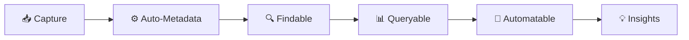
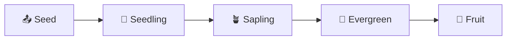

> [!orbit] Wayfinder | [[🗺️My PKM MOC]] | [[🏛️My PKM Governance]] | 🔢My PKM Metadata | [[🔍My PKM Queries]] |  [[📁My PKM Folders]] |  [[🏷️My PKM Tags]] |  [[🔁My PKM Workflows]] | [[✅My PKM Tasks]] | [[ℹ️My PKM Naming Convention]]

# 📊 PKM Metadata Standards

> [!info]+ **⚡ Metadata Overview**
> **Purpose**: Consistent data structure for findability, automation, and insights  
> **Philosophy**: Minimal overhead, maximum utility  
> **Automation**: Templater + Dataview + QuickAdd  
> **Maintenance**: Quarterly review and optimization

---

## 🎯 Metadata Philosophy




---

### **Core Principles**

> [!success]+ **Metadata Best Practices**
> - ✅ **Consistency** - Always use same format and naming conventions
> - ✅ **Minimal Overhead** - Only metadata you actually use
> - ✅ **Automation First** - Templater and QuickAdd reduce manual effort
> - ✅ **Evolution Ready** - Schema adapts with workflow needs
> - ✅ **Integration** - Connected with tags, folders, and queries

---

## 📊 Universal Metadata Schema

### [[base]] YAML Properties (All Notes) 
>*Dublin Core inspired*

```
title: for query
type: atomic|effort|source|moc|meeting|prompt|person|place|tool|area|system|dashboard|about|guide|tutorial|daily|weekly|monthly|quarterly|yearly|challenge|archive
status: 📥inbox|🔄active|⏳waiting|✅completed|📦archived|⏸️paused|❌cancelled|⚠️blocked
tags: 
created: YYYY-MM-DD
modified: YYYY-MM-DD
related: 
- "[[]]"
fileClass: base|atomic|effort|source|moc|meeting|prompt|archive
```

## 🔢 Ordered Metadata  #🧹tidy - yaml_orchestrator will be
> Using yaml_reorder metadata will be ordered. Use this command: 

[[Guide — YAML Orchestrator|Read more]]
```
<%* tp.user.yaml_reorder(tp) %>
```
### **This is the order** in base script: CLICK TO SEE MORE 
```
  const baseOrder = [
  // Navigation
"up",    
"in",
  // Identity
"title",
"aliases",
"type",
"fileClass",
"cssclass",
"tags",

  // State
"status",
"maturity",
"priority",
"processing_priority",
"completeness",
"coverage_areas",
"action_required",

  // Time & Scheduling
"created",
"modified",
"start",
"due",  // ⚠️ Standardized: use "due" instead of "deadline" (auto-renamed by YAML Orchestrator)
"end",
"last_review",
"review_frequency", 
"estimated_effort",

// Actions & Progress
"completion_percentage",
"next_actions",
"capture_method",
"linked_notes_count",

// Knowledge & Quality
"confidence_level", 
"evidence_quality",
"read_status",
"rating_type",

// Source & External
"source_author",
"source_date", 
"source_type",

// Context & Collaboration
"participants",
"location", 
"meeting_type",
"action_items",

// Specialized (AI/Prompts)
"audience",
"difficulty", 
"prompt_category",
"prompt_type",

// Relations (stay at end)
"related",
"see_also",
"related_concepts",
"related_ideas",

// People (future-proofing)
"role",
"org", 
"company",
"email",
"phone",
"website",
"twitter",
"github", 
"linkedin"
  ];
```

---

## 🗂️ Type-Specific Metadata Extensions

### **📥 [[+Inbox]] — Capture Metadata**

> [!SEED]+ **Purpose**
> Quick triage and prioritization during daily processing  
> **Automation**: Templater auto-fills capture context

```
title: "Quick Capture Item"
type: atomic
status: 📥inbox
created: 2025-06-08
tags: [\#📥inbox]
processing_priority: [urgent|normal|low]
estimated_effort: [<5min|5-15min|15-30min|>30min]
```

**Capture Method Values**:
- `quickadd` - QuickAdd macro capture
- `manual` - Direct file creation
- `mobile` - Obsidian mobile app
- `voice` - Voice memo transcription
- `web` - Web clipper or highlight

---

### **🗺️ [[01-MOCs]] — Map Metadata**

> [!map]+ **Purpose**
> Track topic coverage and navigation effectiveness  
> **Automation**: Dataview counts linked notes automatically

```
title: "MOC - Topic Name"
type: moc
tags: 
- 🗺️MOC,
- topic-name
created: 2025-09-30
modified: 2025-09-30
coverage_areas:
- "Subtopic 1"
- "Subtopic 2"
- "Subtopic 3"
last_review: 2025-09-30
review_frequency: weekly|monthly|quarterly
completeness: draft|partial|comprehensive
related:
- "[[Related MOC]]"
- "[[Parent Area]]"
fileClass: MOC
```

---

### **💡 [[02-Dots]] — Atomic Metadata**

> [!atom]+ **Purpose**
> Track idea development from seed to evergreen  
> **Automation**: Maturity tracking for knowledge growth

```
title: "Atomic Concept"
type: atomic
status: 🔄active
tags: 
-💡atomic
- topic-name
created: 2025-09-30
modified: 2025-09-30
maturity: 📤seed|🌱seedling|🪴sapling|🌲evergreen|🍓fruit
domain: psychology|tech|business|health|finance
source_inspiration: "[[Source Note]]"
confidence_level: high|medium|low|uncertain
evidence_quality: strong|moderate|weak|anecdotal
related:
- "[[Related Concept 1]]"
- "[[Related Concept 2]]"
fileClass: Atomic
```

**Maturity Progression**:

| Stage         | Icon | Description                       | Exit Criteria                        |
| ------------- | ---- | --------------------------------- | ------------------------------------ |
| **Seed**      | 📤   | Raw capture, minimal context      | Basic metadata + folder move         |
| **Seedling**  | 🌱   | Early development, some links     | 2+ links, structured content         |
| **Sapling**   | 🪴   | Growing content, rich connections | 5+ links, 2+ backlinks               |
| **Evergreen** | 🌲   | Stable, foundational knowledge    | Frequently referenced, comprehensive |
| **Fruit**     | 🍓   | Original insight, external value  | Published, actionable output         |

---

### **🚀 [[03-Efforts]] — Project Metadata**

> [!rocket]+ **Purpose**
> Project tracking and progress management  
> **Automation**: Weekly review updates project status

```
title: "Project Name"
type: effort
status: 🔄active
tags: 
-🚀effort
-domain-name
created: 2025-09-30
modified: 2025-09-30
project_status: active|paused|completed|archived
effort_type: experiment|learning|building|shipping
priority: high|medium|low
energy: high|medium|low
context: work|home|computer|calls|errands
due: 2025-12-31
completion_percentage: 25
next_action: "Specific next step"
blockers:
- "Blocker 1"
- "Blocker 2"
related:
- "[[Related Effort]]"
- "[[Supporting Area]]"
fileClass: Effort
```

**GTD-Enhanced Fields**:

```
action_required: true|false
waiting_for: "Person/Event/Date"
time_required: <5min|5-15min|15-30min|>30min
delegated_to: "Person Name"
someday_maybe: false
```

---

### **📚 04-Sources — Reference Metadata**

> [!book]+ **Purpose**
> Track reading progress and source quality  
> **Automation**: Key insights count from linked atomics

```
***
title: "Book/Article/Video Title"
type: source
status: 🔄active
tags: 
- 📚source
- domain-name
created: 2025-09-30
modified: 2025-09-30
source_type: book|article|video|podcast|course|paper
source_author: "Author Name"
source_url: "https://example.com"
source_date: 2025-01-01
read_status: unread|reading|completed|reference
isbn: "978-xxx-xxx"
rating: 1|2|3|4|5
notes_extracted: 10
related:
- "[[Related Source]]"
- "[[Topic MOC]]"
fileClass: Source
***
```

**Source Type Specific**:
- **Books**: `isbn`, `publisher`, `pages`, `audiobook_length`
- **Articles**: `publication`, `word_count`
- **Videos**: `platform`, `duration`, `channel`
- **Podcasts**: `episode_number`, `series`, `duration`

---

### **📅 04-01-Meetings — Meeting Metadata**

> [!calendar]+ **Purpose**
> Track meeting outcomes and action items  
> **Automation**: Action items extracted to task list

#🧹tidy - validate the metadata + folder is not in place
```
***
title: "Meeting - Topic"
type: meeting
status: ✅completed
tags: 
- 🤝meeting
created: 2025-09-30
modified: 2025-09-30
meeting_date: 2025-09-30
meeting_time: "14:00"
duration: 60min
participants:
- "[[Person 1]]"
- "[[Person 2]]"
meeting_type: standup|planning|review|retrospective|1-on-1
location: office|remote|hybrid
recording_link: "https://..."
action_items:
- "[ ] Action 1 @person1"
- "[ ] Action 2 @person2"
decisions_made:
- "Decision 1"
- "Decision 2"
related:
- "[[Project]]"
- "[[Previous Meeting]]"
fileClass: Meeting
***
```

---

### **👥 [[300-People]] — Person Metadata**

> [!user]+ **Purpose**
> Relationship intelligence and context  
> **Automation**: Last interaction from meeting notes

```
***
title: "Person Name"
type: person
status: 🔄active
tags: 
- 👥person
- relationship-type
created: 2025-09-30
modified: 2025-09-30
relationship: colleague|mentor|friend|family|client
context: work|personal|community
contact_method: email|phone|slack|linkedin
last_interaction: 2025-09-30
interaction_frequency: daily|weekly|monthly|quarterly
areas_of_expertise:
- "Skill 1"
- "Skill 2"
shared_interests:
- "Interest 1"
- "Interest 2"
related:
- "[[Meetings]]"
- "[[Projects Together]]"
fileClass: Person
***
```

---

### **🛠️ [[500-Tools]] — Tool Metadata**

> [!wrench]+ **Purpose**
> Capability enhancement and tool mastery tracking  
> **Automation**: Usage frequency from log

#🧹tidy - add to type list? + WHAT IS ROI
```
***
title: "Tool Name"
type: tool
status: 🔄active
tags: [\#🛠️tool, \#category]
created: 2025-09-30
modified: 2025-09-30
tool_category: software|hardware|methodology|framework
tool_type: productivity|creative|analysis|health
rating: 1|2|3|4|5
mastery_level: beginner|intermediate|advanced|expert
usage_frequency: daily|weekly|monthly|rarely
cost: free|one-time|subscription
platform: windows|mac|linux|ios|android|web|cross-platform
last_used: 2025-09-30
roi_score: high|medium|low
related:
- "[[Related Tool]]"
- "[[Area Using Tool]]"
fileClass: Tool
***
```

---

### **📍 [[600-Places]] — Location Metadata**

> [!map-pin]+ **Purpose**
> Geographic intelligence and travel context  
> **Automation**: Visit count from calendar notes

```
***
title: "Place Name"
type: place
status: 🔄active
tags: [\#📍place, \#location-type]
created: 2025-09-30
modified: 2025-09-30
place_type: city|country|venue|landmark|restaurant
location_coordinates: "lat, long"
visit_status: wishlist|visited|frequent
visit_count: 5
last_visit: 2025-09-30
rating: 1|2|3|4|5
highlights:

- "Highlight 1"
- "Highlight 2"
recommendations:
- "Recommendation 1"
related:
- "[[Trip Notes]]"
- "[[People Met Here]]"
fileClass: Place
***
```

---

### **📅 [[05-Calendar]] — Temporal Metadata**

#### **Daily Notes**
#🧹tidy - validate metadata and check fileClass
```
***
title: "2025-09-30 Monday"
type: daily
status: 🔄active
tags: 
-📅daily
date: 2025-09-30
week_number: 40
energy: high|medium|low
mood: 😊|😐|😔|😤
focus_area: [[Project Name]]
wins_today: 3
related:
- "[[2025-W40]]"
- "[[2025-09]]"
fileClass: Daily
***
```

#### **Weekly Notes**
#🧹tidy - validate metadata and CREATE fileClass
```
***
title: "2025-W40"
type: weekly
status: ✅completed
tags: 
-📅weekly
week_start: 2025-09-28
week_end: 2025-10-04
theme: "Weekly Focus Theme"
wins: 5
challenges: 2
lessons_learned: 3
related:
- "[[2025-09]]"
- "[[Days of Week]]"
fileClass: Weekly
***
```

---

### **📦 06-Archive — Archive Metadata**

> [!archive]+ **Purpose**
> Audit trail and retention management  
> **Automation**: Archive workflow adds metadata

#🧹tidy  - Think about. Because what will happen with the metadata from before? This is unncessary i think
```
***
title: "Archived Item"
type: [original-type]
status: 📦archived
tags: [\#📦archived, \#original-tags]
created: 2025-09-30
modified: 2025-09-30
archived_date: 2025-09-30
archive_reason: completed|obsolete|superseded|low-value|consolidated
original_location: "03-Efforts"
retention_period: 1-year|2-years|5-years|permanent
delete_after: 2027-09-30
outcome_summary: "What was achieved"
lessons_learned: "Key takeaways"
related:
- "[[Successor Note]]"
fileClass: Archived
***
```

---

## 🎯 Specialized Metadata Systems

### **🌱 Maturity Tracking System**
[[Maturity Evolve|Read here]]
> [!growth]+ **Knowledge Development Pipeline**
> Inspired by Nick Ang's growth philosophy



**Promotion Checklist**:

**📤 → 🌱 (Seed to Seedling)**
- [ ] Title is clear and descriptive
- [ ] Type assigned (atomic/effort/source)
- [ ] Basic tags applied
- [ ] Moved from Inbox to proper folder
- [ ] Content has structure (headers, paragraphs)
- [ ] At least 2 outbound links + 1 backlink

**🌱 → 🪴 (Seedling to Sapling)**
- [ ] 5+ internal links (outbound)
- [ ] 2+ backlinks (inbound references)
- [ ] Content is comprehensive and complete
- [ ] No major rewrites needed in 30+ days
- [ ] Referenced in MOC or index note

**🪴 → 🌲 (Sapling to Evergreen)**
- [ ] 10+ internal links
- [ ] 5+ backlinks from multiple sources
- [ ] Stable for 90+ days
- [ ] Frequently referenced
- [ ] Part of knowledge structure

**🌲 → 🍓 (Evergreen to Fruit)**
- [ ] Content adapted for external audience
- [ ] Published on external platform
- [ ] Generates external engagement/value
- [ ] Creates actionable outcome
- [ ] Demonstrates real-world application

---

### **⚡ Energy & Context System** (GTD-Inspired)

> [!battery]+ **Smart Task & Time Management**
> Match tasks to energy levels and available contexts

```
energy: high|medium|low
context: work|home|computer|calls|errands|anywhere
time_required: <5min|5-15min|15-30min|>30min
```

**Energy Levels**:

| Level | Description | Best For | Time of Day |
|-------|-------------|----------|-------------|
| **High** | Full focus, creative work | Deep work, problem solving | Morning (8-12) |
| **Medium** | Standard concentration | Meetings, planning, writing | Afternoon (1-4) |
| **Low** | Can do when tired | Admin, email, filing | Late day (4-6) |

**Context Values**:
- `work` - Office environment needed
- `home` - Personal space
- `computer` - Digital tools required
- `calls` - Phone/video calls
- `errands` - Outside activities
- `anywhere` - Location-independent

---

### **🎯 Priority Matrix** (Eisenhower Method)

```
priority: high|medium|low|someday
urgency: high|low
importance: high|low
```

| Priority | Urgency | Importance | Action |
|----------|---------|------------|--------|
| **High** | High | High | Do First |
| **Medium** | Low | High | Schedule |
| **Low** | High | Low | Delegate |
| **Someday** | Low | Low | Eliminate/Defer |

---

## 🤖 Automation Integration

**Basic Auto-Metadata**:
```
***
title: "<% tp.file.title %>"
created: "<% tp.date.now("YYYY-MM-DD") %>"
modified: "<% tp.date.now("YYYY-MM-DD") %>"
***
```

**Context-Based Auto-Tagging**:
```
<%
const hour = moment().hour();
let context = "work";
if (hour < 9 || hour > 17) context = "home";
%>
context: <%= context %>
```

**Auto-Maturity Based on Folder**:
```
<%
const folder = tp.file.folder(true);
let maturity = "📤seed";
if (folder.includes("02-Dots")) maturity = "🌱seedling";  // 📤seed → 🌱seedling
if (folder.includes("01-MOCs")) maturity = "🌲evergreen";
%>
maturity: <%= maturity %>
```


### **Dataview Query Examples**
[[🔍My PKM Queries|Read more]]
**Active Projects Dashboard**:
```

TABLE WITHOUT ID
file.link as "Project",
priority as "Priority",
due as "Due Date",
next_action as "Next Action"
FROM "03-Efforts"
WHERE status = "🔄active"
SORT priority DESC, due ASC

```

**Maturity Distribution**:
```

TABLE WITHOUT ID
maturity as "Stage",
length(rows) as "Count"
FROM "02-Dots"
WHERE type = "atomic"
GROUP BY maturity
SORT maturity ASC

```

**Reading List by Status**:
```

TABLE WITHOUT ID
file.link as "Source",
source_author as "Author",
rating as "Rating",
read_status as "Status"
FROM "04-Sources"
WHERE source_type = "book"
SORT rating DESC, read_status ASC

```

---

## 🩺 Metadata Health Monitoring

### **Missing Metadata Query**

```

TABLE WITHOUT ID
file.link as "Note",
type as "Type",
created as "Created"
FROM ""
WHERE !title OR !type OR !status OR !created
SORT created DESC

```

### **Metadata Completeness Score**

```

const pages = dv.pages('"02-Dots"').where(p => p.type == "atomic");
const requiredFields = ["title", "type", "status", "maturity", "tags"];

pages.forEach(p => {
let score = 0;
requiredFields.forEach(f => {
if (p[f]) score++;
});
dv.paragraph(`${p.file.link}: ${score}/${requiredFields.length} (${Math.round(score/requiredFields.length*100)}%)`);
});

```

---

## 📋 Metadata Best Practices

### **Do's ✅**

- ✅ Use Templater for auto-fill (reduce manual entry)
- ✅ Keep metadata consistent across similar note types
- ✅ Review and prune unused fields quarterly
- ✅ Use enumerations for queryable values
- ✅ Document custom metadata in this note
- ✅ Link metadata to automation workflows

### **Don'ts ❌**

- ❌ Add metadata "just in case" without clear use
- ❌ Use free text where enums would work better
- ❌ Create per-note custom fields (standardize!)
- ❌ Skip automation opportunities
- ❌ Let metadata diverge from templates
- ❌ Ignore broken or inconsistent metadata

---

## 🔄 Metadata Evolution Process

### **Quarterly Metadata Review**

**Review Checklist**:
- [ ] Which fields are actually used in queries?
- [ ] Which fields are always empty/ignored?
- [ ] Are there patterns suggesting new fields?
- [ ] Do enumerations need new values?
- [ ] Is automation keeping metadata current?
- [ ] Are templates properly configured?

**Evolution Workflow**:
1. **Audit** - Run health queries to find gaps
2. **Analyze** - Identify unused or needed fields
3. **Design** - Plan metadata changes
4. **Update** - Modify templates and docs
5. **Migrate** - Bulk update existing notes (MetaEdit plugin)
6. **Validate** - Verify changes via Dataview

---

## 🔗 Related System Notes

- [[MOC - Visual Identity]] – Visual standards hub (maturity icons, status emojis)
- [[🔁My PKM Workflows]] - How metadata drives automation
- [[+About Templatesℹ️]] - Metadata in templates
- [[🔍My PKM Queries]] - Dataview query collection
- [[🏛️My PKM Governance]] - System standards and rules
- [[🏷️My PKM Tags]] - Tag taxonomy and usage

---

> [!quote]+ **💭 Metadata Philosophy**
> *"Metadata is the nervous system of your PKM - invisible infrastructure that enables intelligent automation. Keep it minimal, consistent, and purposeful. Let templates do the work, and focus on the knowledge."*

---

## 🛡️ Metadata Validation & Automation Tools (v2.0)

> [!hint]+ **Added in Vault Optimization v2.0**
> These tools enforce metadata consistency automatically.

### YAML Validator (`yaml_validator.js`)
Validates note frontmatter against type-specific schemas. Checks required fields, enum values (status, maturity, priority), date formats, and array/numeric types. Supports 15+ note types including periodic notes.

```
<%* await tp.user.yaml_validator() %>
```

### Maturity Promoter (`maturity-promoter.js`)
Analyzes notes and suggests maturity stage promotions based on link metrics and stability:
- **📤 → 🌱**: 2+ outlinks, 1+ backlink
- **🌱 → 🪴**: 5+ outlinks, 2+ backlinks, 30+ days stable
- **🪴 → 🌲**: 10+ outlinks, 5+ backlinks, 90+ days stable
- **🌲 → 🍓**: Manual (external publication/application)

### Metrics Core (`metrics-core.js`)
Single source of truth for all vault metrics. Provides health scoring (0-100), gamification XP/level calculations, and weekly activity metrics. Used by dashboards, weekly reports, and the metrics cache.

### Status & Maturity Pickers
- **`status-picker.js`** — QuickAdd UI for changing note status
- **`maturity-evolve.js`** — QuickAdd UI for changing maturity stage

### Weekly Report Generator (`generate-weekly-report.js`)
Automated weekly report with metrics, highlights, maturity pipeline, and 8-week trend visualization. Outputs to `05-Calendar/Weekly/`.

### Query Templates (`Templates/Queries/`)
Six reusable Dataview query templates:
- **Active Projects** — Efforts with status `🔄active`, sorted by priority
- **Health Status** — Weighted vault health score (0-100)
- **Inbox Processing** — GTD inbox with age indicators
- **Maturity Distribution** — Knowledge pipeline visualization
- **Orphan Notes** — Disconnected notes for review
- **Weekly Stats** — Task completion rate and note creation velocity

### YAML Orchestrator Auto-Tidy
The `yaml_orchestrator.js` now tags notes with `#🧹tidy` when required fields are missing (validation step 5b).

---

*Last Updated: 2026-02-21 | Review: Quarterly | Status: 🟢 Optimized & Automated*


## **Key Features:**

### **📊 Complete Coverage**

- **Universal schema** + 10 type-specific extensions
- **Maturity tracking** with visual progression
- **GTD integration** with energy \& context
- **Automation examples** with Templater and Dataview


### **🎨 Visual Excellence**

- **Mermaid diagrams** for workflows
- **Comparison tables** for field references
- **Promotion checklists** with clear criteria
- **Color-coded callouts** for each note type


### **🤖 Practical Automation**

- **Templater scripts** for auto-fill
- **Dataview queries** for dashboards
- **Health monitoring** queries
- **Metadata completeness** scoring


### **🎯 Actionable Structure**

- **Field-by-field reference** with purpose and automation
- **Best practices** (Do's and Don'ts)
- **Quarterly review** process
- **Evolution workflow** for continuous improvement

This creates the complete metadata backbone of your PKM system - comprehensive, visual, and immediately actionable! 📊✨


---
#🧹tidy - OLD 
### 04-[[Templates/Static/source|source]] Metadata (References)

>**Účel:** Sledování čtení a hodnocení zdrojů
>**Automatizace:** maturity applied

```
title: "Book/Article/Video Title"
type: source
status: 🔄active
fileClass: source
tags:
  - 📚source
status: ✅completed
maturity: 🌲evergreen
priority: high
processing_priority: normal
completeness: comprehensive
confidence_level: high
evidence_quality: peer-reviewed
read_status: completed
rating_type: 4⭐⭐⭐⭐
source_author: "Tiago Forte"
source_date: 2022-06-14
source_type: book
```

### 04-01 [[99-System/FileClass/meeting]] metadata

```
meeting_date: YYYY-MM-DD
participants: ["person1", "person2"]
meeting_type: [standup|planning|review|retrospective]
action_items: ["item1", "item2"]
```
### [[05-Calendar]] Metadata
---
- [ ] #### 05-01-Daily Metadata

>**Účel:** Zapisování denní činnosti a reflexe
>**Automatizace:** Auto-přidáno při Ctrl+Alt+D (otevře se i při otevření vaultu)

```
energy: [low|medium|high]
mood: 
```
- [ ] #### 05-02-Weekly Metadata

>**Účel:** Zapisování denní činnosti a reflexe
>**Automatizace:** Auto-přidáno při Ctrl+Alt+XXX. Linkováno k jednotlivým Daily.

```

```
- [ ] #### 05-03-Monthly Metadata

>**Účel:** Zapisování denní činnosti a reflexe
>**Automatizace:** Auto-přidáno při Ctrl+Alt+XXXX Linkováno k jednotlivým Weekly.

```

```

- [ ] #### 05-04-Yearly Metadata

>**Účel:** Zapisování denní činnosti a reflexe
>**Automatizace:** Auto-přidáno při Ctrl+Alt+XXXX Linkováno k jednotlivým Monthly.
```

```
### 06-[[archive]] Metadata

>**Účel:** Audit trail a retention management
>**Automatizace:** Auto-přidáno při Ctrl+Alt+A (Archive workflow)

```
up: "[[Career Development MOC]]"
in: "[[06-Archive]]" 
title: "Learn Advanced Python for Data Analysis"
aliases: ["Python Data Analysis Project", "Python Learning 2025"]
type: archive
fileClass: archive
tags:
  - 📦archived
  - 🎓learning
status: 📦archived
completion_percentage: 100
created: 2025-06-15
modified: 2025-09-20
start: 2025-06-15
end: 2025-09-20
archive_reason: completed
original_location: "03-Efforts"
completion_date: 2025-09-20
retention_period: 2-years
related:
  - "[[]]"
original_tags: ["🚀project", "📊data", "🧠learning"]
```

---


⬆️:: [[🗺️My PKM MOC]]

[[Overview of Metadata - be aware query]]
---
#🧹tidy 
What about [[🔢My PKM Metadata#🤖 Automation Integration]]

or [[🔢My PKM Metadata#🎯 Specialized Metadata Categories]] 

or [[🔢My PKM Metadata#**Energy & Context System (GTD inspired)**]]


## 🎯 Best Practices Summary

**Konzistence:** Vždy používej stejný formát a [[🔢My PKM Metadata#Missing Metadata Query|naming metadata conventions]]
**Minimální overhead:** Pouze metadata která skutečně používáš
**Automatizace:** Templater a QuickAdd snižují manual effort
**Evolution:** Metadata schema se vyvíjí s potřebami workflow
**Integration:** Propojeno s tag systémem a folder strukturou

---

## 🎯 Specialized Metadata Categories

### [[Maturity Evolve]] (Nick Ang inspired)

# PKM 4-State Pipeline: Seed → Note → Evergreen → Output
## 🔄 **State Definitions**
## 📤 **SEED** (Raw Capture)
**Purpose:** Immediate capture without friction  
**Entry:** Any new idea, thought, or information  
**Characteristics:** Unstructured, minimal metadata, inbox location  
**Exit Criteria:**
- Has clear title and type assigned
- Basic metadata complete (created, status, tags)
- Moved to appropriate folder (02-Dots, 03-Efforts, 04-Sources)
- **WIP Limit:** 15 items max
## 🌱 **NOTE** (Structured Knowledge)
**Purpose:** Developed, linked, actionable knowledge  
**Entry:** Seed with complete metadata and proper location  
**Characteristics:** Structured content, 2+ internal links, clear context  
**Exit Criteria:**
- 5+ internal links (dense connection)
- Referenced by 2+ other notes (proven value)
- Content is stable (no major rewrites needed)
- **WIP Limit:** 25 items max
## 🌲 **EVERGREEN** (Stable Reference)
**Purpose:** Foundational knowledge, frequently referenced  
**Entry:** Note with proven stability and connection density  
**Characteristics:** Comprehensive, authoritative, frequently linked  
**Exit Criteria:**
- Content published/shared externally
- Actionable output created (article, presentation, tool)
- Value demonstrated beyond personal use
- **WIP Limit:** No limit (stable state)
## 🍓 **OUTPUT** (External Value)
**Purpose:** Knowledge transformed into external deliverable  
**Entry:** Evergreen content ready for external consumption  
**Characteristics:** Published, shared, monetized, or productized  
**Exit Criteria:** Archive when no longer relevant/active  
**WIP Limit:** No limit (achievement state)

---
## ✅ **Note Promotion Checklist**
## 📤 → 🌱 (Seed to Note)
-  Title is clear and descriptive
-  Type assigned (atomic/project/source/meeting)
-  Basic tags applied (#context, #priority)
-  Moved from +Inbox to proper folder
-  Content has structure (headers, paragraphs)
-  At least 1 internal link added
## 🌱 → 🌲 (Note to Evergreen)
-  5+ internal links (outbound)
-  2+ backlinks (inbound references)
-  Content is comprehensive and complete
-  No major rewrites needed in 30+ days
-  Referenced in MOC or index note
-  Evidence quality is strong/moderate
## 🌲 → 🍓 (Evergreen to Output)
-  Content adapted for external audience
-  Published on external platform
-  Generates external engagement/value
-  Creates actionable outcome
-  Demonstrates real-world application
-  Archive-ready when lifecycle complete

**Workflow integration:**
- Weekly Recall & Reflect aktualizuje maturity
- Dataview sleduje distribution across maturity levels
- Templates automaticky začínają jako 📤seed

```
maturity: 📤seed      \# Seedbox - items actively working on
maturity: 🌱seedling  \# Grown from literature, needs incubation
maturity: 🪴sapling   \# Ready for dense linking
maturity: 🌲evergreen \# Stable, fundamental knowledge
maturity: 🍓fruit     \# Original work, publishable
```

### **Energy & Context System (GTD inspired)**
- [ ] #🌱develop not implemented
**Workflow integration:**
- Daily planning podle current energy level
- Context-based task filtering
- Time-of-day recommendations

```
energy: high    \# Requires full focus, creative work
energy: medium  \# Standard concentration needed
energy: low     \# Can do when tired, admin tasks

context: work     \# Office environment needed
context: home     \# Personal space
context: computer \# Digital tools required
context: calls    \# Phone/video calls
context: errands  \# Outside activities
```

```
# Enhanced GTD metadata
action_required: true | false
waiting_for: "person" | "event" | "date"
energy_required: "high" | "medium" | "low"
time_required: "<5min" | "5-15min" | "15-30min" | ">30min"
context_required: "computer" | "phone" | "office" | "errands"
```

## Priority Matrix

**Automatizace:**
- QuickAdd templates s priority prompts
- Daily dashboard filtruje podle priority
- Weekly review přehodnocuje priority

```

priority: high    \# Urgent \& Important (Do First)
priority: medium  \# Important, Not Urgent (Schedule)
priority: low     \# Urgent, Not Important (Delegate)
priority: someday \# Neither Urgent nor Important (Eliminate)

```

## 🤖 Automation Integration
#🌱develop 
### Templater Auto-Fill Scripts - APPLIED 

```
// Auto-metadata pro nové poznámky
title: "<% tp.file.title %>"
created: "<% tp.date.now("YYYY-MM-DD") %>"
modified: "<% tp.date.now("YYYY-MM-DD") %>"
author: "Your Name"
```

// Context-based auto-tagging - NOT APPLIED 
```
<%
const hour = moment().hour();
let context = "work";
if (hour < 9 || hour > 17) context = "home";
%>

context: <%= context %>
```


// Auto-maturity based on folder
```
<%
const folder = tp.file.folder(true);
let maturity = "📤seed";
if (folder.includes("Sources")) maturity = "🌱seedling";
%>
maturity: <%= maturity %>
```


## Vault-Specific Metadata

*Přizpůsobení pro tento vault:*

- [ ] Doplnit specifická pole
- [ ] Definovat custom typy
- [ ] Upravit status hodnoty