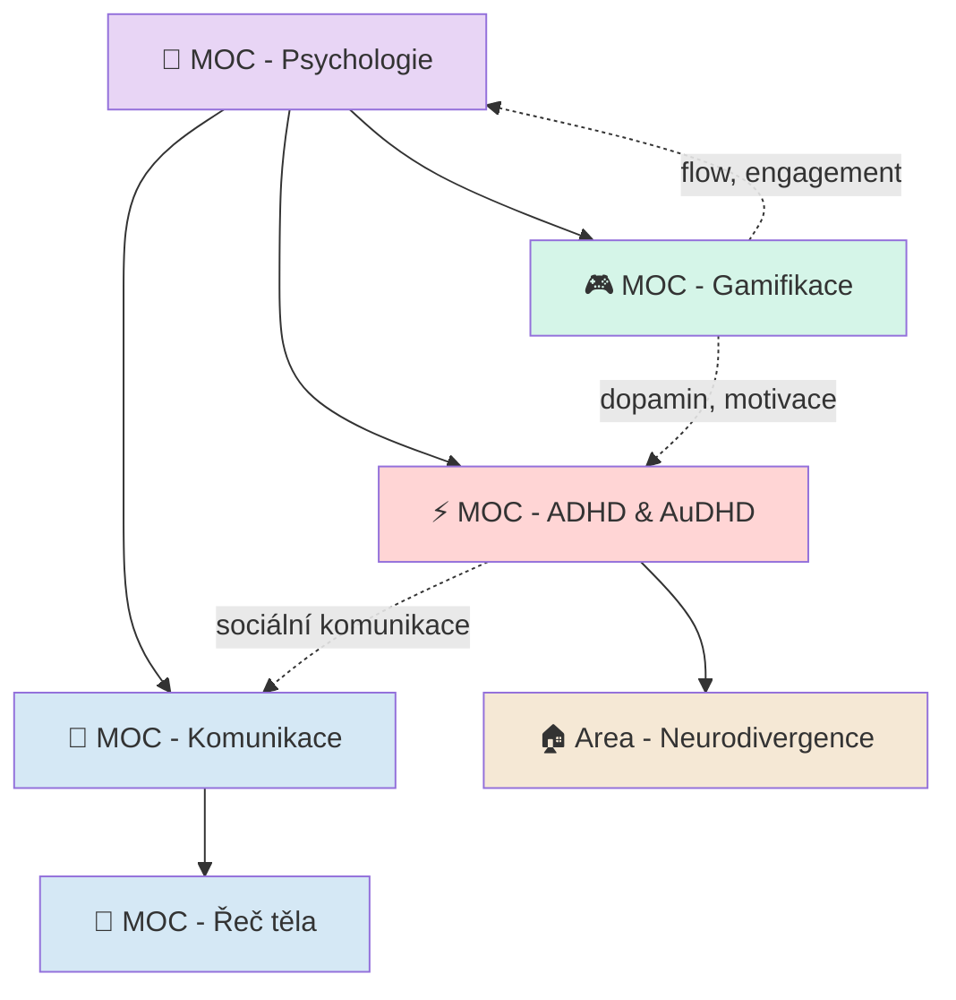

# 🧠 PKM New Topics — Structure Design

> Návrh struktury pro 5 nových tematických oblastí: **Komunikace**, **Řeč těla**, **Psychologie**, **Gamifikace**, **ADHD vs AuDHD**

---

## 1. Kam to patří v architektuře

Tvých 5 témat se mapuje na existující vrstvy takto:

| Téma | Primární umístění | Typ | Důvod |
|------|-------------------|-----|-------|
| **Psychologie** | `01-MOCs/` + `02-Dots/100-Atomics/Concepts/` | MOC (zastřešující) | Střechový doménový hub — komunikace, řeč těla i ADHD jsou jeho podmnožiny |
| **Komunikace** | `01-MOCs/` + `02-Dots/100-Atomics/Concepts/` | MOC | Praktická doména s vlastními koncepty a technikami |
| **Řeč těla** | `01-MOCs/` + `02-Dots/100-Atomics/Concepts/` | MOC (sub-MOC komunikace) | Specifická subdoména komunikace |
| **Gamifikace** | `01-MOCs/` + `02-Dots/100-Atomics/Concepts/` | MOC | Průřezové téma (propojení s ADHD, produktivitou) |
| **ADHD vs AuDHD** | `01-MOCs/` + `02-Dots/200-Areas/210-Health/` | MOC + Area | Osobní zdravotní oblast + znalostní báze |

### Hierarchie MOC

```
MOC - Psychologie (zastřešující)
├── MOC - Komunikace
│   └── MOC - Řeč těla (sub-MOC)
├── MOC - ADHD & AuDHD
└── MOC - Gamifikace (cross-link z Psychologie i Produktivity)
```

---

## 2. Navržené MOC soubory

### 2.1 MOC - Psychologie

**Soubor**: `01-MOCs/MOC - Psychologie.md`

```yaml
---
up: "[[🗺️My PKM MOC]]"
in:
  - "[[01-MOCs]]"
title: MOC - Psychologie
type: moc
fileClass: moc
tags:
  - 🗺️MOC
  - "#domain/psychology"
status: 🔄active
maturity: 📤seed
priority: high
coverage_areas:
  - kognitivní psychologie
  - sociální psychologie
  - neuropsychologie
  - behaviorální vědy
created: 2026-03-20
modified: 2026-03-20
related:
  - "[[MOC - Komunikace]]"
  - "[[MOC - ADHD & AuDHD]]"
  - "[[MOC - Gamifikace]]"
---
```

**Klíčové subtopiky k rozvoji**:
- Kognitivní zkreslení (cognitive biases)
- Motivace a odměňování (→ link na gamifikaci)
- Emoční regulace (→ link na ADHD)
- Sociální psychologie (→ link na komunikaci)
- Behaviorální vzorce

---

### 2.2 MOC - Komunikace

**Soubor**: `01-MOCs/MOC - Komunikace.md`

```yaml
---
up: "[[MOC - Psychologie]]"
in:
  - "[[01-MOCs]]"
title: MOC - Komunikace
type: moc
fileClass: moc
tags:
  - 🗺️MOC
  - "#domain/psychology"
  - "#skill/communication"
status: 🔄active
maturity: 📤seed
priority: high
coverage_areas:
  - verbální komunikace
  - neverbální komunikace
  - aktivní naslouchání
  - persuaze a vliv
  - asertivita
created: 2026-03-20
modified: 2026-03-20
related:
  - "[[MOC - Psychologie]]"
  - "[[MOC - Řeč těla]]"
  - "[[MOC - ADHD & AuDHD]]"
---
```

**Klíčové subtopiky**:
- Aktivní naslouchání
- Asertivní komunikace
- Persuazivní techniky (Cialdini, rétorika)
- Komunikace v konfliktu
- Storytelling
- Komunikace s ADHD/AuDHD mozkem (cross-link)

---

### 2.3 MOC - Řeč těla

**Soubor**: `01-MOCs/MOC - Řeč těla.md`

```yaml
---
up: "[[MOC - Komunikace]]"
in:
  - "[[01-MOCs]]"
title: MOC - Řeč těla
type: moc
fileClass: moc
tags:
  - 🗺️MOC
  - "#domain/psychology"
  - "#skill/communication"
status: 🔄active
maturity: 📤seed
priority: medium
coverage_areas:
  - mimika a mikroexprese
  - gestika
  - proxemika
  - posturologie
  - oční kontakt
created: 2026-03-20
modified: 2026-03-20
related:
  - "[[MOC - Komunikace]]"
  - "[[MOC - Psychologie]]"
---
```

**Klíčové subtopiky**:
- Mikroexprese (Ekman) — 7 základních emocí
- Gestika — otevřená vs uzavřená
- Proxemika — osobní zóny
- Posturologie — power poses, signály dominance/submise
- Oční kontakt — délka, úhel, kulturní rozdíly
- Detekce lži a nekongruence

---

### 2.4 MOC - Gamifikace

**Soubor**: `01-MOCs/MOC - Gamifikace.md`

```yaml
---
up: "[[MOC - Psychologie]]"
in:
  - "[[01-MOCs]]"
title: MOC - Gamifikace
type: moc
fileClass: moc
tags:
  - 🗺️MOC
  - "#domain/psychology"
  - "#domain/productivity"
status: 🔄active
maturity: 📤seed
priority: high
coverage_areas:
  - herní mechaniky
  - motivační design
  - engagement loops
  - PKM gamifikace
created: 2026-03-20
modified: 2026-03-20
related:
  - "[[MOC - Psychologie]]"
  - "[[MOC - ADHD & AuDHD]]"
---
```

**Klíčové subtopiky**:
- Octalysis framework (Yu-kai Chou) — 8 core drives
- Flow state (Csíkszentmihályi) → link na psychologii
- Intrinsická vs extrinsická motivace (SDT — Deci & Ryan)
- Dopaminový systém a ADHD (→ cross-link)
- Herní mechaniky: XP, úrovně, achievementy, streak, quest
- Gamifikace v PKM (tvůj vlastní systém v Origin!)
- Dark patterns vs etická gamifikace

---

### 2.5 MOC - ADHD & AuDHD

**Soubor**: `01-MOCs/MOC - ADHD & AuDHD.md`

```yaml
---
up: "[[MOC - Psychologie]]"
in:
  - "[[01-MOCs]]"
title: MOC - ADHD & AuDHD
type: moc
fileClass: moc
tags:
  - 🗺️MOC
  - "#domain/psychology"
  - "#domain/health"
status: 🔄active
maturity: 📤seed
priority: high
coverage_areas:
  - ADHD
  - AuDHD (ADHD + autismus)
  - neurodivergence
  - strategie a kompenzace
created: 2026-03-20
modified: 2026-03-20
related:
  - "[[MOC - Psychologie]]"
  - "[[MOC - Gamifikace]]"
  - "[[MOC - Komunikace]]"
---
```

**Klíčové subtopiky**:

#### ADHD základ
- Exekutivní funkce a deficity
- Dopaminový systém
- Hyperfokus vs rozptýlení
- Emoční dysregulace (RSD — Rejection Sensitive Dysphoria)
- Časová slepota (time blindness)

#### AuDHD specifika
- Co je AuDHD (ADHD + autismus overlap)
- Masking a kompenzační strategie
- Senzorický profil — overload vs seeking
- Sociální komunikace u AuDHD (→ link na komunikaci)
- Meltdown vs shutdown vs ADHD overwhelm
- Rutiny vs novost (protichůdné potřeby)

#### Strategie
- Body doubling
- External scaffolding (→ link na gamifikaci!)
- Časové techniky (Pomodoro variace, time blocking)
- PKM jako kompenzační nástroj

---

## 3. Area note — ADHD & Neurodivergence

ADHD/AuDHD je nejen znalostní téma, ale i **osobní oblast života**. Doporučuji vytvořit area note:

**Soubor**: `02-Dots/200-Areas/210-Health/Area – Neurodivergence.md`

```yaml
---
up: "[[MOC - Areas]]"
in: "[[210-Health]]"
title: "Area – Neurodivergence"
type: area
fileClass: Area
tags:
  - 🏠area
  - "#domain/health"
  - "#domain/psychology"
status: 🔄active
maturity: 📤seed
priority: high
created: 2026-03-20
modified: 2026-03-20
related:
  - "[[MOC - ADHD & AuDHD]]"
  - "[[MOC - Areas]]"
  - "[[MOC - Gamifikace]]"
---
```

Tato area bude sledovat:
- Osobní strategie a co funguje/nefunguje
- Léky / suplementy / rutiny
- Energetické vzorce a denní plánování
- Senzorický toolkit

---

## 4. Navržené tagy

### Nové domain tagy

| Tag | Použití |
|-----|---------|
| `#domain/psychology` | Vše pod psychologií |
| `#domain/communication` | Komunikační koncepty |
| `#domain/neurodivergence` | ADHD, AuDHD, autismus |
| `#domain/gamification` | Gamifikační koncepty |

### Nové skill tagy

| Tag | Použití |
|-----|---------|
| `#skill/communication` | Komunikační dovednosti |
| `#skill/body-language` | Řeč těla jako skill |
| `#skill/self-management` | Sebeřízení (ADHD strategie) |

### Cross-topic tagy (volitelně)

| Tag | Použití |
|-----|---------|
| `#lens/adhd` | Pohled přes ADHD optiku na jakékoli téma |
| `#lens/gamified` | Gamifikovaný přístup k čemukoli |

> **Proč `#lens/`?** Umožní ti tagovat poznámky typu "Komunikace z pohledu ADHD" nebo "Gamifikovaný denní plán" bez duplikace domain tagů.

---

## 5. Starter Atomic Notes (Seeds)

Doporučené první poznámky pro každé téma — umístění `02-Dots/100-Atomics/Concepts/`:

### Psychologie
| Poznámka | Subtopic | Maturity |
|----------|----------|----------|
| Kognitivní zkreslení — přehled | cognitive biases | 📤seed |
| Dunning-Kruger efekt | cognitive biases | 📤seed |
| Konfirmační zkreslení | cognitive biases | 📤seed |
| Maslowova pyramida potřeb | motivace | 📤seed |
| Self-Determination Theory (SDT) | motivace | 📤seed |
| Flow state | optimální výkon | 📤seed |

### Komunikace
| Poznámka | Subtopic | Maturity |
|----------|----------|----------|
| Aktivní naslouchání — techniky | listening | 📤seed |
| 4 úrovně naslouchání | listening | 📤seed |
| Nenásilná komunikace (NVC) | conflict | 📤seed |
| Cialdiniho principy persuaze | persuasion | 📤seed |
| Asertivní komunikace vs agrese vs pasivita | assertiveness | 📤seed |
| Storytelling — struktura příběhu | storytelling | 📤seed |

### Řeč těla
| Poznámka | Subtopic | Maturity |
|----------|----------|----------|
| 7 základních mikroexpresí (Ekman) | mimika | 📤seed |
| Power pose a postoj | posturologie | 📤seed |
| Proxemika — 4 zóny osobního prostoru | proxemika | 📤seed |
| Clustery vs izolované signály | analýza | 📤seed |
| Oční kontakt — pravidla a kulturní rozdíly | oční kontakt | 📤seed |

### Gamifikace
| Poznámka | Subtopic | Maturity |
|----------|----------|----------|
| Octalysis framework — 8 core drives | framework | 📤seed |
| Intrinsická vs extrinsická motivace | motivace | 📤seed |
| Dopaminový loop a návykový design | neurověda | 📤seed |
| Engagement loop — trigger → action → reward | mechanika | 📤seed |
| Dark patterns v gamifikaci | etika | 📤seed |
| Gamifikace pro ADHD mozek | cross-topic | 📤seed |

### ADHD & AuDHD
| Poznámka | Subtopic | Maturity |
|----------|----------|----------|
| ADHD — exekutivní funkce (přehled) | základ | 📤seed |
| RSD — Rejection Sensitive Dysphoria | emoce | 📤seed |
| Časová slepota (time blindness) | čas | 📤seed |
| AuDHD — protichůdné potřeby | audhd | 📤seed |
| Masking a jeho cena | kompenzace | 📤seed |
| Body doubling — proč funguje | strategie | 📤seed |
| Senzorický profil — seeker vs avoider | senzorické | 📤seed |
| ADHD a dopamin — proč gamifikace funguje | cross-topic | 📤seed |

---

## 6. Doporučené zdroje (Sources)

Pro `04-Sources/Knowledge/`:

| Zdroj | Typ | Téma |
|-------|-----|------|
| *Thinking, Fast and Slow* — Daniel Kahneman | 📚 book | Psychologie, kognitivní zkreslení |
| *What Every BODY is Saying* — Joe Navarro | 📚 book | Řeč těla |
| *The Definitive Book of Body Language* — Allan Pease | 📚 book | Řeč těla |
| *Actionable Gamification* — Yu-kai Chou | 📚 book | Gamifikace, Octalysis |
| *Driven to Distraction* — Hallowell & Ratey | 📚 book | ADHD |
| *Influence* — Robert Cialdini | 📚 book | Persuaze, komunikace |
| *Nonviolent Communication* — Marshall Rosenberg | 📚 book | Komunikace |
| HowToADHD (YouTube) | 🎥 video | ADHD strategie |
| The Gamification Toolkit (Coursera/edX) | 🎓 course | Gamifikace |

---

## 7. Propojení a cross-links



**Silné cross-linky**:
- **Gamifikace ↔ ADHD**: Dopaminový systém, external scaffolding, motivační design pro ADHD mozek
- **Komunikace ↔ ADHD**: Sociální obtíže, RSD v konverzaci, masking
- **Řeč těla ↔ ADHD/AuDHD**: Atypický oční kontakt, stimming vs gesta, senzorické přetížení v sociálních situacích
- **Psychologie → vše**: Zastřešující doména

---

## 8. Jak dál rozvíjet

### Fáze 1 — Základy (týden 1–2) ✅
- [x] Vytvořit 5 MOC souborů (použij `moc-meta.yaml.md` + `moc-body.md` šablony)
- [x] Vytvořit Area – Neurodivergence
- [x] Napsat prvních 5–10 seed atomic notes (po 1–2 z každého tématu) — vytvořeno 31 seed notes
- [x] Přidat nové tagy do `CIS_TOPIC_CATEGORIES.md`

### Fáze 2 — Plnění (týden 3–6) ✅
- [x] Přidat source notes pro klíčové knihy/videa — 9 source notes vytvořeno
- [x] Rozvíjet seed → seedling (doplnit kontext, příklady, vlastní zkušenosti) — 6 klíčových notes upgradováno
- [x] Vytvářet cross-links mezi tématy — všech 31+ notes propojeno cross-domain
- [x] Založit effort: "Effort – Prozkoumej AuDHD" (v `03-Efforts/On/`)

### Fáze 3 — Propojování (měsíc 2–3)
- [ ] Vytvářet "bridge notes" — koncepty na průsečíku 2 témat
  - Např. "Gamifikace pro ADHD mozek", "Řeč těla u neurodivergentních"
- [ ] Přidávat `#lens/adhd` a `#lens/gamified` k existujícím poznámkám
- [ ] Přidávat praktické "playbook" poznámky (konkrétní techniky k použití)

### Fáze 4 — Zrání (ongoing)
- [ ] Promovat mature notes na 🌲evergreen
- [ ] Psát MOC review notes — identifikovat mezery
- [ ] Propojit s denními/týdenními review (sledování strategií)
- [ ] Zvážit effort: "Effort – Komunikační playbook"

---

## 9. Metadata rozšíření (volitelné)

Pro ADHD/AuDHD poznámky můžeš přidat custom YAML pole:

```yaml
# Volitelná rozšíření pro neurodivergence notes
energy_level: high | medium | low    # Jak náročný je koncept na zpracování
practical_rating: 1-5                 # Jak prakticky využitelný
tested: true | false                  # Vyzkoušel jsem osobně?
```

Pro gamifikaci (už máš základ v `99-System/CIS/gamification-*`):
```yaml
game_mechanic: xp | streak | quest | achievement | level
motivation_type: intrinsic | extrinsic | both
```

---

*Vytvořeno: 2026-03-20 | Autor: Claude | Status: Návrh k diskuzi*
