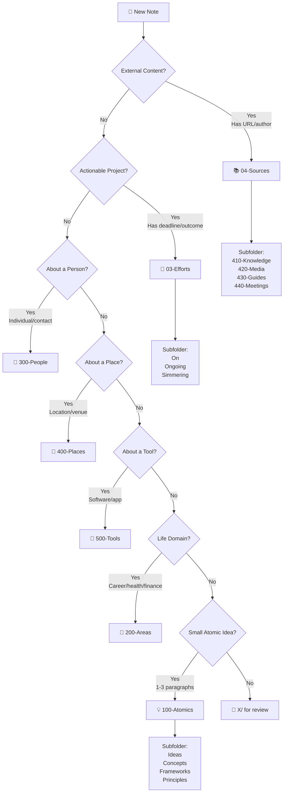

# 📍 Where Does This Note Belong?

> [!info] Purpose
> This guide helps you quickly determine where a new note should live in your vault.
> **TL;DR**: Use the decision tree below or just run `Ctrl+P` → **🤖Smart Classify Note** for automatic suggestions!

---

## 🚀 Quick Decision Tree



---

## 📋 Keyword Detection Guide

### 📚 04-Sources (External Input)

**Indicators:**
- Contains URL or external reference
- Mentions "read", "watched", "listened to"
- Has author, publisher, or creator
- Words: `zdroj`, `source`, `kniha`, `book`, `článek`, `article`, `video`, `podcast`

**Examples:**
- "Book: Atomic Habits by James Clear"
- "Watched YouTube video on PKM systems"
- "Article from Medium about productivity"

**Subfolders:**
- `410-Knowledge` → Books, courses, articles
- `420-Media` → Videos, podcasts, talks
- `430-Guides` → Tutorials, how-tos, documentation
- `440-Meetings` → Meeting notes, interviews

**Auto-Process:** `Ctrl+P` → ⚡Quick Process - Source

---

### 🚀 03-Efforts (Projects & Tasks)

**Indicators:**
- Contains deadline or timeline
- Has tasks (checkboxes)
- Mentions "projekt", "project", "úkol", "task", "cíl", "goal"
- Has completion percentage or status
- Words: `do`, `build`, `achieve`, `complete`, `deliver`

**Examples:**
- "Build new website for portfolio"
- "Learn Spanish for travel"
- "Complete Q1 financial planning"

**Subfolders:**
- `On` → Active, deadline ≤7 days
- `Ongoing` → Active, deadline ≤30 days
- `Simmering` → Future, deadline >30 days

**Auto-Process:** `Ctrl+P` → ⚡Quick Process - Effort

---

### 💡 100-Atomics (Ideas & Concepts)

**Indicators:**
- Short (1-3 paragraphs)
- Single concept or principle
- Connects to 3+ other notes
- Words: `myšlenka`, `idea`, `koncept`, `concept`, `princip`, `principle`, `framework`, `pattern`

**Examples:**
- "The Two-Minute Rule for task management"
- "Concept: Emergence in complex systems"
- "Framework: The Eisenhower Matrix"

**Subfolders:**
- `Ideas` → Raw inspiration, brainstorms
- `Concepts` → Theoretical constructs
- `Frameworks` → Structured methodologies
- `Principles` → Universal rules, laws
- `Patterns` → Recurring templates
- `Mental-Models` → Thinking tools

**Auto-Process:** `Ctrl+P` → ⚡Quick Process - Atomic

---

### 👤 300-People

**Indicators:**
- Person's name in title
- Contains contact info, bio, or relationship context
- Words: `person`, `osoba`, `contact`, `colleague`, `friend`, `mentor`

**Examples:**
- "John Smith - Colleague from Marketing"
- "Dr. Jane Doe - Therapist"
- "Alice Johnson - Mentor"

**Auto-Process:** `Ctrl+P` → 🤖Smart Classify Note

---

### 📍 400-Places

**Indicators:**
- Location, venue, or geographic place
- Contains address or coordinates
- Words: `place`, `místo`, `location`, `venue`, `city`, `restaurant`, `café`

**Examples:**
- "Prague - Old Town Square"
- "Favorite Coffee Shop - Downtown"
- "Spain - Barcelona Travel Notes"

**Auto-Process:** `Ctrl+P` → 🤖Smart Classify Note

---

### 🔧 500-Tools

**Indicators:**
- Software, app, or tool name
- Contains setup instructions or features
- Words: `tool`, `nástroj`, `app`, `software`, `platform`, `service`

**Examples:**
- "Obsidian - PKM Setup"
- "Notion - Team Workspace"
- "VS Code - Favorite Extensions"

**Auto-Process:** `Ctrl+P` → 🤖Smart Classify Note

---

### 🎯 200-Areas (Life Domains)

**Indicators:**
- Ongoing responsibility (no end date)
- Life domain: career, health, finance, relationships
- Words: `area`, `oblast`, `career`, `health`, `finance`, `family`

**Examples:**
- "Career Development Plan"
- "Health - Fitness Routine"
- "Personal Finance Strategy"

**Subfolders:**
- `210-Career` → Professional development
- `220-Health` → Physical/mental wellness
- `230-Finance` → Money management
- `240-Relationships` → Social connections
- `250-Learning` → Skill acquisition

**Auto-Process:** `Ctrl+P` → 🤖Smart Classify Note

---

### 🤷 X/ (Experimental/Unclear)

**When to Use:**
- Confidence <30% on classification
- Doesn't fit any category above
- Temporary holding for further review

**What to Do:**
1. Move note to `02-Dots/X/`
2. Add `status: 📥inbox` frontmatter
3. Review weekly during [[🧠GTD Weekly Review]]
4. Reclassify once purpose becomes clear

---

## 🤖 Automation Quick Reference

### Fully Automated Classification

**Command:** `Ctrl+P` → **🤖Smart Classify Note**

**What it does:**
1. Analyzes content + title
2. Suggests type, folder, tags, maturity
3. Shows confidence score (0-100%)
4. Lets you accept/edit/reject
5. Auto-moves + applies metadata

**Best for:** When unsure where note belongs

---

### One-Click Processing (Type-Specific)

**Commands:**
- `Ctrl+P` → **⚡Quick Process - Atomic** → 10-15 sec processing
- `Ctrl+P` → **⚡Quick Process - Source** → Structured template + move
- `Ctrl+P` → **⚡Quick Process - Effort** → Deadline-based folder

**Best for:** When you know the type, want instant processing

---

### Batch Inbox Clearing

**Command:** `Ctrl+P` → **📦Batch Process Inbox**

**What it does:**
1. Classifies all notes in +Inbox
2. Shows summary table with suggestions
3. Bulk approve high-confidence items
4. Review individual low-confidence items

**Best for:** Weekly inbox cleanup (20-30 notes in 2-3 min)

---

## 💡 Pro Tips

### Tip 1: When in Doubt, Use +Inbox
- Capture fast, classify later
- Better to have it in +Inbox than lost
- Use weekly review to process

### Tip 2: Aim for 80/20 Rule
- 80% of notes should be obvious (Sources, Efforts, Atomics)
- 20% might need manual review (X/, Areas, People)
- Don't overthink it!

### Tip 3: Metadata Matters More Than Folder
- With Dataview, queries work across folders
- Type field is more important than physical location
- Folder = organizational convenience, not hard boundary

### Tip 4: Use Related Field Aggressively
- Connections > perfect classification
- Link to 3+ related notes = better findability
- Use Metadata Menu for quick visual linking

### Tip 5: Review Classification Monthly
- Your system evolves with you
- Notes can be reclassified as context changes
- Use [[📈Performance Metrics Dashboard]] to spot orphans

---

## 📊 Classification Flowchart (Text Version)

If you prefer a step-by-step checklist:

```
1. Does it have a URL or external source?
   → YES: 04-Sources (subfolder by type)
   → NO: Continue

2. Does it have a deadline or completion status?
   → YES: 03-Efforts (subfolder by timeline)
   → NO: Continue

3. Is it about a person (name in title)?
   → YES: 02-Dots/300-People
   → NO: Continue

4. Is it about a place (location/venue)?
   → YES: 02-Dots/400-Places
   → NO: Continue

5. Is it about a tool (software/app)?
   → YES: 02-Dots/500-Tools
   → NO: Continue

6. Is it a life domain (career/health/finance)?
   → YES: 02-Dots/200-Areas (subfolder by domain)
   → NO: Continue

7. Is it a short atomic idea (1-3 paragraphs)?
   → YES: 02-Dots/100-Atomics (subfolder by type)
   → NO: Continue

8. Still unclear?
   → 02-Dots/X/ → Review during weekly review
```

---

## 🔗 Related Resources

- [[🏡Home]] - Start here guide
- [[TODO]] - Task management workflow
- [[🧠GTD Weekly Review]] - Weekly processing routine
- [[📈Performance Metrics Dashboard]] - System health monitoring
- [[🗺️My PKM MOC]] - Complete system overview

---

## 🆘 Still Stuck?

**Option 1: Use Smart Classify**
`Ctrl+P` → 🤖Smart Classify Note → Let AI suggest

**Option 2: Default to X/**
Move to `02-Dots/X/` → Review during [[🧠GTD Weekly Review]]

**Option 3: Ask Yourself:**
- Will I reference this again? → Atomics or Sources
- Do I need to act on it? → Efforts
- Is it a specific entity (person/place/tool)? → Respective folder
- Is it a life responsibility? → Areas
- None of the above? → X/

---

*Guide Version: 1.0*
*Last Updated: 2026-01-16*
*Automation Scripts: smart-classifier.js, quick-process-*.js*
