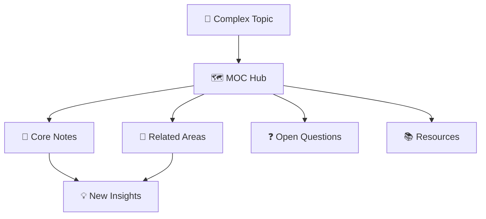

⬆️:: [[01-MOCs]]
# About MOCs (Maps of Content)

> [!tip]+ **⚡ Quick Reference**
> **What**: Navigation hubs that organize related knowledge around specific topics  
> **Why**: Find connections, explore topics systematically, prevent knowledge silos  
> **How**: Collect → Structure → Connect → Navigate  
> **Success**: Easy topic exploration, clear knowledge boundaries, natural discovery paths

---

## 🗺️ What MOCs Do




MOCs are like **topic headquarters** - they gather everything related to a subject in one organized place, making complex knowledge navigable and discoverable.

**Not just link collections** - MOCs provide context, structure, and thinking frameworks  
**Not rigid hierarchies** - MOCs evolve organically as knowledge grows

---

## 📋 MOC Structure

### **🎯 Core Components**

```
🗺️ MOC - [Topic Name]  
├── 📄 Abstract (scope & boundaries)  
├── 🧩 Core Subtopics  
│ ├── Models & Frameworks  
│ ├── Skills & Techniques  
│ ├── Tools & Resources  
│ └── Anti-patterns & Pitfalls  
├── ⚓ Anchors (start here links)  
├── ❓ Open Questions  
└── 🔗 Related MOCs
```


### **📊 Real MOC Examples**

> [!example]+ **🗺️ MOC - Learning Systems**
> **Abstract**: How people acquire, retain, and apply new knowledge across different domains
> 
> **Core Subtopics**:
> - **Models**: Spaced repetition, deliberate practice, active recall
> - **Skills**: Note-taking, synthesis, teaching others  
> - **Tools**: Anki, PKM systems, learning journals
> - **Anti-patterns**: Passive consumption, cramming, isolated facts
>
> **Anchors**: [[Spaced Repetition]], [[Active Learning]], [[Learning Transfer]]

> [!example]+ **🗺️ MOC - Productivity Systems** 
> **Abstract**: Methods and tools for getting meaningful work done efficiently
>
> **Core Subtopics**:
> - **Frameworks**: GTD, PARA, Time blocking, Energy management
> - **Skills**: Focus, prioritization, automation, delegation
> - **Tools**: Task managers, calendars, automation scripts
> - **Contexts**: Deep work, meetings, communication, planning
>
> **Anchors**: [[Deep Work]], [[Getting Things Done]], [[Energy Management]]

---

## 🎭 MOC Types & Purposes

| Type | Icon | Purpose | Example |
|------|------|---------|---------|
| **Topic MOC** | 🗺️ | Explore subject domain | MOC - Machine Learning |
| **Index MOC** | 📑 | Navigate large collections | MOC - All Book Notes |
| **Timeline MOC** | 📅 | Chronological organization | MOC - Project History |
| **Process MOC** | ⚙️ | Workflow documentation | MOC - Content Creation |
| **Dashboard MOC** | 📊 | Active project overview | MOC - Current Efforts |

---

## 🔄 MOC Lifecycle

### **🌱 Seedling MOCs** (5-15 notes)
- Start when you have several notes on same topic
- Simple list format with basic categorization
- Focus on collecting and initial organization

### **🪴 Growing MOCs** (15-50 notes)
- Develop clear structure and subtopics
- Add abstracts and scope definitions
- Create anchor points for easy entry

### **🌲 Mature MOCs** (50+ notes)
- Rich navigation with multiple entry paths
- Connected to other MOCs and systems
- Include open questions and research directions

---

## 🧭 Using MOCs Effectively

### **Daily Navigation**
- Start with relevant MOC when exploring topics
- Add new discoveries to appropriate MOCs
- Use MOCs to find related knowledge quickly

### **Weekly MOC Maintenance**
- Review and update MOC structures
- Add new notes to relevant MOCs
- Identify missing connections or gaps

### **Monthly MOC Evolution**
- Assess MOC effectiveness and usage
- Split large MOCs or merge small ones
- Create new MOCs for emerging topic clusters

---

## 🎯 MOC Best Practices

> [!success]+ **✅ MOC Success Patterns**
> - **Clear Boundaries** - Define what belongs and what doesn't
> - **Multiple Entry Points** - Various ways to dive into the topic
> - **Regular Updates** - Keep MOCs current with new knowledge
> - **Cross-Connections** - Link to related MOCs and Areas
> - **Question-Driven** - Include open questions to guide exploration

> [!warning]+ **⚠️ Common MOC Pitfalls**
> - **Over-Engineering** - Making MOCs too complex too early
> - **Rigid Structure** - Forcing notes into inappropriate categories  
> - **Neglected Updates** - Letting MOCs become outdated
> - **Isolation** - MOCs that don't connect to broader system
> - **Analysis Paralysis** - Perfect organization preventing exploration

---

## 🔗 MOC Integration

**Core Connections:**
- [[👁️Dashboard]] → Active MOCs for current interests and projects
- [[+ About Dotsℹ️]] → MOCs organize Dots into coherent knowledge domains
- [[+About Areasℹ️]] → MOCs support specific life areas with organized knowledge
- [[+About Effortsℹ️]] → Project-specific MOCs for complex initiatives

**Knowledge Flow:**
- **Sources** feed into MOCs through processed knowledge
- **MOCs** surface patterns that become new **Atomic insights**
- **Queries** can automatically populate MOC sections
- **Archive** preserves historical MOC states for knowledge evolution

---

*Last Updated: 2025-09-30 | Review: Monthly | Status: 🟢 Navigation-Ready*


