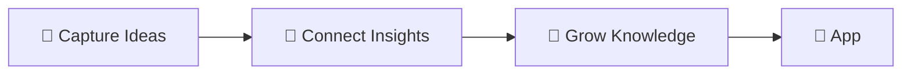

⬆️:: "[[Atomics]]"
# About Atomics 💡

> [!info]+ **👋 Personal Introduction**
> I'm a systems thinker and knowledge architect who believes that big ideas emerge from connecting small insights. This vault captures my journey of continuous learning and personal growth through structured knowledge management.

---

## 🎯 My Goals with This Vault

- **🧠 Build Intelligent Knowledge**: Transform scattered thoughts into connected insights
- **📈 Accelerate Learning**: Create compound growth through knowledge connections
- **🎨 Enhance Creativity**: Generate new ideas through systematic idea collision
- **⚡ Improve Decision-Making**: Access relevant insights when needed most
- **🤝 Share Wisdom**: Help others by documenting what I learn

---

## 🧩 What Are Atomics?

> [!tip]+ **⚡ Quick Reference**
> **What**: Individual insights, concepts, and mental models that form your intellectual building blocks  
> **Why**: Small, connected ideas create large, powerful understanding  
> **How**: Capture → Develop → Connect → Apply → Teach  
> **Success**: Rich idea networks that enhance thinking and decision-making

**Atomics are the DNA of knowledge** - small, self-contained units that combine to create complex understanding. Each atomic note captures one clear idea that can connect with others to generate new insights.

---

## 🌍 Topics I Explore

### **🏗️ Systems & Architecture**
- Personal Knowledge Management
- System design principles
- Workflow optimization
- Information architecture

### **🧠 Learning & Cognition** 
- Mental models and frameworks
- Learning methodologies
- Memory and retention techniques
- Critical thinking patterns

### **💼 Professional Growth**
- Data science and analytics
- Leadership and management
- Career development strategies
- Industry insights and trends

### **🎯 Personal Development**
- Productivity systems
- Decision-making frameworks
- Habit formation and change
- Life design and planning

### **🔬 Innovation & Technology**
- Emerging tech trends
- AI and machine learning
- Digital transformation
- Future of work patterns

---

## 🛠️ Tools & Methods I Use

### **📝 Capture & Processing**
| Tool | Purpose | Rating |
|------|---------|--------|
| **Obsidian** | Primary PKM system | ⭐⭐⭐⭐⭐ |
| **Templater** | Note automation | ⭐⭐⭐⭐⭐ |
| **Readwise** | Article processing | ⭐⭐⭐⭐ |
| **Voice memos** | Mobile capture | ⭐⭐⭐⭐ |

### **📊 Analysis & Connection**
- **Dataview queries** for dynamic knowledge views
- **Graph analysis** for connection discovery
- **Tag systems** for thematic organization
- **MOCs (Maps of Content)** for topic navigation

### **⚡ Workflows**
🔍 Daily: Capture new insights (5-10 min)  
🔗 Weekly: Connect and develop ideas (15-20 min)  
🌱 Monthly: Review atomic evolution (30 min)  
🎯 Quarterly: Knowledge architecture refinement (60 min)

---

## 🏗️ My Atomic System Structure

### **📊 Atomic Lifecycle**
![[Maturity Evolve]]

> [!example]+ **🌱 Growing Atomic: "Progressive Disclosure in Learning"**
> **One-liner**: Information should be revealed layer by layer to prevent cognitive overload
> 
> **Evidence**: 
> - Personal experience with template design
> - Research on cognitive load theory
> - Success in teaching complex concepts
> 
> **Connections**: Links to [[Learning Systems]], [[Information Architecture]], [[Teaching Methods]]
> 
> **Next Development**: Test with online course design

### **🎯 Atomic Categories**

| Category | Icon | Focus | Examples |
|----------|------|-------|----------|
| **Mental Models** | 🧠 | Thinking frameworks | Systems thinking, First principles |
| **Methodologies** | ⚙️ | Process approaches | GTD, Progressive summarization |
| **Insights** | 💡 | Original discoveries | Personal patterns, Observations |
| **Concepts** | 📚 | Knowledge definitions | Technical terms, Theory explanations |
| **Principles** | 🎯 | Guiding rules | Design principles, Life philosophies |

---

## 📈 Atomic Success Patterns

### **🔄 Development Workflow**
1. **Capture**: Quick one-liner of the insight
2. **Elaborate**: Add context, evidence, examples  
3. **Connect**: Link to related atomics and concepts
4. **Apply**: Use in real situations and projects
5. **Teach**: Explain to others to deepen understanding

### **🎯 Quality Indicators**
- ✅ **Clear one-liner** - Core idea in one sentence
- ✅ **Rich connections** - Links to 3+ related concepts  
- ✅ **Evidence base** - Examples or supporting research
- ✅ **Practical application** - Used in real decisions/projects
- ✅ **Evolution ready** - Can be developed further

---

## 🚀 Getting Started

> [!rocket]+ **Launch Your Atomic Practice**
> 
> ### **Week 1: Foundation**
> - Capture 3-5 insights using [[A-Full-Template]]
> - Focus on clear one-liners and basic connections
> - Choose topics from your current interests
> 
> ### **Week 2-4: Development**
> - Add evidence and examples to existing atomics
> - Create connection networks between related ideas
> - Experiment with different atomic categories
> 
> ### **Month 2+: Mastery**
> - Develop mature atomics that you can teach others
> - Create atomic-based content (writing, presentations)
> - Build specialized collections around key topics

---

## 🔗 Integration with Broader System

**Connected to:**
- [[+About Areasℹ️]] → Atomics that support specific life domains
- [[+About Effortsℹ️]] → Ideas that drive active projects  
- [[+About Sourcesℹ️]] → Insights extracted from external content
- [[+About Peopleℹ️]] → Concepts learned through relationships
- [[+About Toolsℹ️]] → Methods and frameworks for capability enhancement

**Feeds into:**
- **Decision-making** → Quick access to relevant mental models
- **Creative work** → Idea combinations for innovation
- **Learning** → Building blocks for complex understanding
- **Teaching** → Refined concepts ready to share with others

---

> [!quote]+ **💭 Personal Philosophy**
> *"The best ideas emerge not from isolation, but from the intelligent collision of connected insights. Every atomic thought is a potential catalyst for breakthrough understanding."*

---

*Last Updated: 2025-09-30 | Review: Monthly | Health: 🟢 Growing Knowledge Network*
