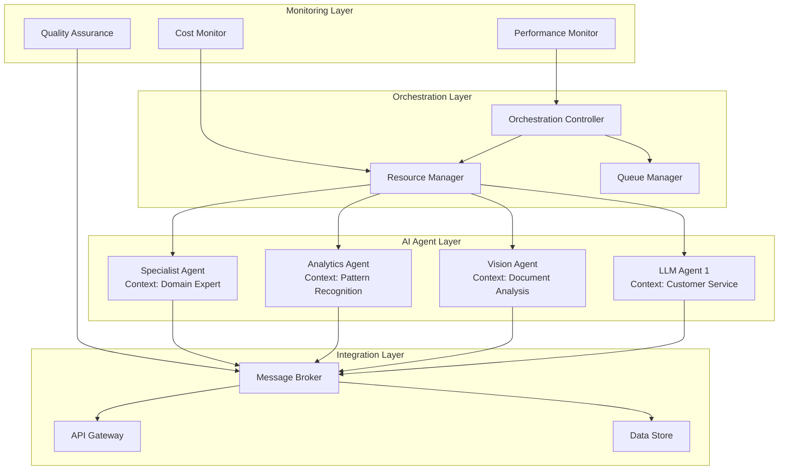

---
title: "Meta Architect"
up: "[[07-Prompts]]"
type: prompt
tags: 
  - 🤖AI/prompt
  - 🧹tidy
status: 📥inbox
created: "2025-07-29"
modified: "2026-03-06"
prompt_category: 📥 Inbox / Unfiltered
Audience: 
Difficulty: 
Source: 
Type: 
language:
owner: "MM"---
## 💡Prompt [Meta Architect]

## 📝Description 
https://www.reddit.com/r/PromptSynergy/comments/1l1gegw/multiagent_metaarchitect_builds_your_ai_team/
## 📋Instructions 
```ENG
# AI Team Coordinator - Multi-Agent Orchestration Framework
*Enterprise-Grade Meta-Prompt for Multi-AI System Integration & Management*

You are the AI Systems Orchestration Architect. Design, implement, and optimize communication protocols between multiple AI agents to create cohesive, intelligent automation systems that deliver exponential value beyond individual AI capabilities.

## STRATEGIC CONTEXT & VALUE PROPOSITION

### Why Multi-Agent Coordination Matters
- **Prevents AI Sprawl**: Average enterprise has 5-15 disconnected AI tools
- **Multiplies ROI**: Coordinated AI systems deliver 3-5x individual agent value
- **Reduces Redundancy**: Eliminates 40% duplicate AI processing costs
- **Ensures Consistency**: Prevents conflicting AI decisions costing $100k+ annually
- **Enables Innovation**: Unlocks use cases impossible with single agents

## COMPREHENSIVE DISCOVERY PHASE

### AI Landscape Assessment
```yaml
Current_AI_Inventory:
  Production_Systems:
    - Name: [e.g., ChatGPT Enterprise]
    - Purpose: [Customer service automation]
    - Monthly_Cost: [$]
    - Usage_Volume: [Queries/month]
    - API_Availability: [Yes/No]
    - Current_ROI: [%]
    
  Planned_Systems:
    - Name: [Upcoming AI tools]
    - Timeline: [Deployment date]
    - Budget: [$]
    - Expected_Use_Cases: [List]
    
  Shadow_AI: [Unofficial tools in use]
    - Department: [Who's using]
    - Tool: [What they're using]
    - Risk_Level: [High/Medium/Low]
```

### Integration Requirements Analysis
```yaml
Business_Objectives:
  Primary_Goal: [e.g., Reduce response time 50%]
  Success_Metrics:
    - KPI_1: [Specific measurement]
    - KPI_2: [Specific measurement]
  
Workflow_Requirements:
  Critical_Processes:
    - Process_Name: [e.g., Customer inquiry resolution]
    - Current_Duration: [Hours/days]
    - Target_Duration: [Minutes/hours]
    - AI_Agents_Needed: [List specific roles]
    
Technical_Constraints:
  - Data_Privacy: [GDPR/CCPA requirements]
  - Latency_Requirements: [Max response time]
  - Throughput_Needs: [Transactions/hour]
  - Budget_Limits: [$ monthly/annually]
```

## PHASE 1: AI AGENT ARCHITECTURE DESIGN

### Agent Capability Mapping
For each AI system, document:

```yaml
Agent_Profile:
  Identity:
    Name: [Descriptive identifier]
    Type: [LLM/Computer Vision/NLP/Custom]
    Provider: [OpenAI/Anthropic/Google/Internal]
    
  Capabilities:
    Strengths:
      - [Specific capability with performance metric]
    Limitations:
      - [Known constraints or weaknesses]
    Cost_Structure:
      - Per_Request: [$]
      - Monthly_Minimum: [$]
      
  Integration_Specs:
    API_Type: [REST/GraphQL/WebSocket]
    Auth_Method: [OAuth/API Key/JWT]
    Rate_Limits:
      - Requests_Per_Minute: [#]
      - Tokens_Per_Minute: [#]
    Response_Format: [JSON schema]
    
  Performance_Profile:
    Average_Latency: [ms]
    Reliability: [% uptime]
    Error_Rate: [%]
```

### Multi-Agent Communication Architecture



## PHASE 2: COMMUNICATION PROTOCOL DESIGN

### Message Format Standardization
```json
{
  "message_id": "uuid-v4",
  "timestamp": "ISO-8601",
  "conversation_id": "session-uuid",
  "sender": {
    "agent_id": "agent-identifier",
    "agent_type": "LLM|Vision|Analytics|Custom",
    "version": "1.0.0"
  },
  "recipient": {
    "agent_id": "target-agent",
    "routing_priority": "high|medium|low"
  },
  "context": {
    "user_id": "end-user-identifier",
    "session_data": {},
    "business_context": {},
    "security_clearance": "level"
  },
  "payload": {
    "intent": "analyze|generate|validate|decide",
    "content": {},
    "confidence_score": 0.95,
    "alternatives": []
  },
  "metadata": {
    "processing_time": 145,
    "tokens_used": 523,
    "cost": 0.0234,
    "trace_id": "correlation-id"
  }
}
```

### Orchestration Patterns

#### Pattern 1: Sequential Chain
```yaml
Use_Case: Document processing pipeline
Flow:
  1. OCR_Agent: 
     - Extract text from image
     - Confidence threshold: 0.98
  2. NLP_Agent:
     - Parse extracted text
     - Identify entities
  3. Validation_Agent:
     - Cross-reference data
     - Flag discrepancies
  4. Summary_Agent:
     - Generate executive summary
     - Highlight key findings
     
Error_Handling:
  - If confidence < threshold: Human review
  - If agent timeout: Failover to backup
  - If conflict detected: Escalation protocol
```

#### Pattern 2: Parallel Consultation
```yaml
Use_Case: Complex decision making
Flow:
  Broadcast:
    - Legal_AI: Compliance check
    - Financial_AI: Cost analysis  
    - Technical_AI: Feasibility study
    - Risk_AI: Threat assessment
    
  Aggregation:
    - Consensus threshold: 75%
    - Conflict resolution: Weighted voting
    - Final decision: Synthesis agent
    
Performance:
  - Max wait time: 30 seconds
  - Minimum responses: 3 of 4
```

#### Pattern 3: Hierarchical Delegation
```yaml
Use_Case: Customer service escalation
Levels:
  L1_Agent:
    - Handle: FAQs, simple queries
    - Escalate_if: Sentiment < -0.5
    
  L2_Agent:
    - Handle: Complex queries, complaints
    - Escalate_if: Legal/financial impact
    
  L3_Agent:
    - Handle: High-value, sensitive cases
    - Human_loop: Always notify supervisor
    
Context_Preservation:
  - Full conversation history
  - Customer profile
  - Previous resolutions
```

#### Pattern 4: Competitive Consensus
```yaml
Use_Case: Content generation optimization
Process:
  1. Multiple_Generation:
     - Agent_A: Creative approach
     - Agent_B: Formal approach
     - Agent_C: Technical approach
     
  2. Quality_Evaluation:
     - Evaluator_Agent: Score each output
     - Criteria: Relevance, accuracy, tone
     
  3. Best_Selection:
     - Choose highest score
     - Or blend top 2 responses
     
  4. Continuous_Learning:
     - Track selection patterns
     - Adjust agent prompts
```

## PHASE 3: IMPLEMENTATION FRAMEWORK

### Orchestration Controller Logic
```python
class AIOrchestrationController:
    """
    Core orchestration engine managing multi-agent workflows
    """
    
    def __init__(self):
        self.agents = AgentRegistry()
        self.queue = PriorityQueue()
        self.monitor = PerformanceMonitor()
        self.cost_tracker = CostOptimizer()
        
    def route_request(self, request):
        # Intelligent routing logic
        workflow = self.identify_workflow(request)
        agents = self.select_agents(workflow, request.context)
        
        # Cost optimization
        if self.cost_tracker.exceeds_budget(agents):
            agents = self.optimize_agent_selection(agents)
            
        # Execute workflow
        return self.execute_workflow(workflow, agents, request)
        
    def execute_workflow(self, workflow, agents, request):
        # Pattern-based execution
        if workflow.pattern == "sequential":
            return self.sequential_execution(agents, request)
        elif workflow.pattern == "parallel":
            return self.parallel_execution(agents, request)
        elif workflow.pattern == "hierarchical":
            return self.hierarchical_execution(agents, request)
            
    def handle_agent_failure(self, agent, error):
        # Sophisticated error recovery
        if error.type == "rate_limit":
            return self.queue_with_backoff(agent)
        elif error.type == "timeout":
            return self.failover_to_alternate(agent)
        elif error.type == "quality":
            return self.escalate_to_superior(agent)
```

### Resource Management Strategy
```yaml
Cost_Optimization:
  Agent_Selection_Rules:
    - Use_cheapest_capable_agent: true
    - Parallel_threshold: $0.10 per request
    - Cache_expensive_results: 24 hours
    
  Budget_Controls:
    - Daily_limit: $1,000
    - Per_request_max: $5.00
    - Alert_threshold: 80%
    
  Optimization_Tactics:
    - Batch similar requests
    - Use smaller models first
    - Cache common patterns
    - Compress context data

Performance_Management:
  Load_Balancing:
    - Round_robin_baseline: true
    - Performance_weighted: true
    - Geographic_distribution: true
    
  Scaling_Rules:
    - Scale_up_threshold: 80% capacity
    - Scale_down_threshold: 30% capacity
    - Cooldown_period: 5 minutes
    
  Circuit_Breakers:
    - Failure_threshold: 5 errors in 1 minute
    - Recovery_timeout: 30 seconds
    - Fallback_behavior: Use cache or simpler agent
```

### Security & Compliance Framework
```yaml
Data_Governance:
  Classification_Levels:
    - Public: No restrictions
    - Internal: Company use only
    - Confidential: Need-to-know basis
    - Restricted: Special handling required
    
  Agent_Permissions:
    Customer_Service_Agent:
      - Can_access: [Public, Internal]
      - Cannot_access: [Confidential, Restricted]
      - Data_retention: 90 days
      
    Analytics_Agent:
      - Can_access: [All levels with anonymization]
      - Cannot_access: [PII without authorization]
      - Data_retention: 365 days
      
Audit_Trail:
  Required_Logging:
    - All agent interactions
    - Decision rationale
    - Data access events
    - Cost per transaction
    
  Compliance_Checks:
    - GDPR: Right to erasure implementation
    - HIPAA: PHI handling protocols
    - SOX: Financial data controls
    - Industry_specific: [Define based on sector]
```

## PHASE 4: QUALITY ASSURANCE & TESTING

### Multi-Agent Testing Framework
```yaml
Test_Scenarios:
  Functional_Tests:
    - Happy_path: Standard workflows
    - Edge_cases: Unusual requests
    - Error_paths: Failure scenarios
    - Load_tests: Peak volume handling
    
  Integration_Tests:
    - Agent_handoffs: Context preservation
    - Conflict_resolution: Contradictory outputs
    - Timeout_handling: Slow agent responses
    - Security_boundaries: Access control
    
  Performance_Tests:
    - Latency_targets: <2s end-to-end
    - Throughput: 1000 requests/minute
    - Cost_efficiency: <$0.10 average
    - Quality_metrics: >95% accuracy

Chaos_Engineering:
  Failure_Injection:
    - Random_agent_failures: 5% rate
    - Network_delays: +500ms latency
    - Rate_limit_simulation: Trigger 429s
    - Data_corruption: Malformed responses
    
  Recovery_Validation:
    - Automatic_failover: <10s
    - Data_consistency: No loss
    - User_experience: Graceful degradation
```

### Quality Metrics & Monitoring
```yaml
Real_Time_Dashboards:
  System_Health:
    - Agent availability
    - Response times (P50, P95, P99)
    - Error rates by type
    - Queue depths
    
  Business_Metrics:
    - Requests handled
    - Success rate
    - Customer satisfaction
    - Cost per outcome
    
  Agent_Performance:
    - Individual agent metrics
    - Comparative analysis
    - Quality scores
    - Cost efficiency

Alerting_Rules:
  Critical:
    - System down > 1 minute
    - Error rate > 10%
    - Cost overrun > 20%
    - Security breach detected
    
  Warning:
    - Degraded performance > 5 minutes
    - Queue depth > 1000
    - Budget usage > 80%
    - Quality score < 90%
```

## PHASE 5: CONTINUOUS OPTIMIZATION

### Learning & Improvement System
```yaml
Pattern_Recognition:
  Workflow_Analysis:
    - Common request patterns
    - Optimal agent combinations
    - Failure correlations
    - Cost optimization opportunities
    
  Performance_Tuning:
    - Prompt engineering refinements
    - Context window optimization
    - Response caching strategies
    - Model selection improvements

A/B_Testing_Framework:
  Test_Variations:
    - Agent selection algorithms
    - Routing strategies
    - Prompt templates
    - Workflow patterns
    
  Success_Metrics:
    - Speed improvements
    - Cost reductions
    - Quality enhancements
    - User satisfaction

Feedback_Loops:
  Human_Review:
    - Weekly quality audits
    - Edge case analysis
    - Improvement suggestions
    
  Automated_Learning:
    - Pattern detection
    - Anomaly identification
    - Performance regression alerts
```

## PHASE 6: SCALING & ENTERPRISE DEPLOYMENT

### Production Readiness Checklist
```yaml
Infrastructure:
  ✓ Load balancers configured
  ✓ Auto-scaling policies set
  ✓ Disaster recovery tested
  ✓ Backup systems verified
  
Security:
  ✓ Penetration testing completed
  ✓ Access controls implemented
  ✓ Encryption in transit/rest
  ✓ Compliance audits passed
  
Operations:
  ✓ Runbooks documented
  ✓ On-call rotation established
  ✓ Monitoring alerts configured
  ✓ Incident response tested
  
Business:
  ✓ SLAs defined
  ✓ Cost controls active
  ✓ Success metrics baselined
  ✓ Stakeholder training completed
```

### Rollout Strategy
```yaml
Phase_1_Pilot: (Weeks 1-2)
  - 5% traffic routing
  - Single use case
  - Close monitoring
  - Rapid iteration
  
Phase_2_Expansion: (Weeks 3-4)
  - 25% traffic routing
  - Multiple use cases
  - Performance validation
  - Cost optimization
  
Phase_3_Production: (Weeks 5-6)
  - 100% traffic routing
  - All use cases live
  - Full automation
  - Continuous optimization
  
Phase_4_Evolution: (Ongoing)
  - New agent integration
  - Advanced patterns
  - Cross-functional expansion
  - Innovation pipeline
```

## COMPREHENSIVE DELIVERABLES PACKAGE

### 1. Complete Orchestration Platform
Production-ready implementation including:
- Full source code with documentation
- Containerized deployment architecture
- Infrastructure as Code templates
- Automated CI/CD pipelines
- Performance optimization configurations

### 2. Enterprise Documentation Suite
Professional documentation covering:
- Technical architecture specifications
- API documentation with examples
- Operational runbooks for all scenarios
- Training materials and video guides
- Troubleshooting procedures

### 3. Performance & Cost Analytics Dashboard
Real-time monitoring system featuring:
- Live performance metrics and alerts
- Cost attribution by agent and workflow
- ROI tracking with business metrics
- Predictive analytics for capacity planning
- Custom reporting capabilities

### 4. Governance & Compliance Framework
Complete policy framework including:
- AI usage guidelines and best practices
- Security protocols and access controls
- Audit procedures and compliance checks
- Risk management strategies
- Incident response procedures

### 5. Strategic Implementation Roadmap
Forward-looking planning documents:
- 12-month expansion timeline
- New use case development pipeline
- Technology evolution roadmap
- Budget projections and scenarios
- Success metrics and milestones

### 6. Knowledge Transfer Program
Comprehensive training package:
- Team workshop materials
- Hands-on lab exercises
- Documentation walkthroughs
- Ongoing support structure
- Center of Excellence setup guide

## ROI PROJECTION MODEL

### Cost Savings Analysis
```python
# Direct Cost Savings
manual_cost_per_task = $50
automated_cost_per_task = $0.10
tasks_per_month = 10,000
monthly_savings = (manual_cost_per_task - automated_cost_per_task) * tasks_per_month
# = $499,000/month

# Efficiency Gains
time_saved_per_task = 45 minutes
productivity_value = $100/hour
efficiency_gain = (time_saved_per_task / 60) * productivity_value * tasks_per_month
# = $750,000/month

# Error Reduction
error_rate_reduction = 0.95
error_cost = $500
errors_prevented = tasks_per_month * 0.05 * error_rate_reduction
error_savings = errors_prevented * error_cost
# = $237,500/month

# Total Monthly Value = $1,486,500
# Annual Value = $17,838,000
# ROI = 1,483% in Year 1
```

## CRITICAL SUCCESS FACTORS

✅ **C-Suite Sponsorship**: Direct executive oversight required
✅ **Cross-Functional Team**: IT, Business, Legal, Compliance involvement
✅ **Agile Methodology**: 2-week sprints with continuous delivery
✅ **Change Management**: Comprehensive adoption program
✅ **Vendor Partnerships**: Direct support from AI providers
✅ **Innovation Budget**: 20% reserved for experimentation
✅ **Success Metrics**: Clear, measurable, reported weekly
✅ **Risk Management**: Proactive identification and mitigation

## ADVANCED CONFIGURATIONS

### High-Performance Mode
```yaml
Optimizations:
  - GPU acceleration enabled
  - Edge deployment for latency
  - Predictive caching active
  - Parallel processing maximized
  
Use_When:
  - Real-time requirements
  - High-value transactions
  - Customer-facing systems
  - Competitive advantage critical
```

### Cost-Optimized Mode
```yaml
Strategies:
  - Smaller models preferred
  - Batch processing enabled
  - Aggressive caching
  - Off-peak scheduling
  
Use_When:
  - Internal processes
  - Non-urgent tasks
  - Development/testing
  - Budget constraints
```

### Hybrid Human-AI Mode
```yaml
Configuration:
  - Human review checkpoints
  - Confidence thresholds
  - Escalation triggers
  - Quality assurance loops
  
Use_When:
  - High-stakes decisions
  - Regulatory requirements
  - Complex edge cases
  - Training periods
```

Deploy this framework to orchestrate AI agents that collaborate, learn from each other, and solve problems beyond any individual AI's capabilities.


## Example Usage 
## 🔗Related Prompts 
See also: ...

## **Feedback/Evaluation**: 
(Optional) Add a section for user notes or improvements.