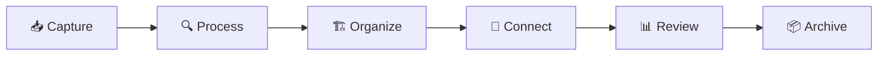

# Origin Vault 🧠 — Template Source

> 📌 **This vault is the template source for derived vaults**: Ideaverse, Muza, Work, and LQ
>
> 🔄 **Git tracks 4 folders**: `00-Meta/` | `99-System/Scripts/` | `99-System/copilot-custom-prompts/` | `Templates/`
>
> ☁️ **Everything else is synced via Obsidian Sync** (vault-specific notes, inbox, calendar, etc.)

## 📖 Updating Your Vault from Origin

```bash
# Pull latest template updates
git pull upstream main
# (or: git pull origin main if using single remote)

# If conflicts occur, resolve them:
git status
nano 99-System/Scripts/my-script.py  # edit conflicted file
git add 99-System/Scripts/my-script.py
git commit -m "merge: resolved conflict with origin template"
```

### 📱 Mobile Sync — No Git Needed
1. Pull template updates on PC (`git pull upstream main`)
2. Obsidian Sync pushes changes to your phone automatically within seconds
3. Git only touches template folders — Obsidian Sync handles vault content

### ❓ How Do I Customize Template Files Locally?

Edit normally, commit to your branch, and Git will merge with Origin's updates when you pull:

```bash
# Customize a script for your vault
nano 99-System/Scripts/my-script.py
git add 99-System/Scripts/my-script.py
git commit -m "customize: adjust script for my workflow"

# Later, when Origin updates:
git pull upstream main
# Git will merge Origin's changes with your customizations
```

---

*Centrální Meta Vault pro Personal Knowledge Management v Obsidianu*
![[Hero-journey-photo.png]]
<div align="center">
<a href="https://discord.gg/veuWUTm">
  
</a>
<a href="https://www.reddit.com/r/ObsidianMD/">
  
</a>
<a href="https://forum.obsidian.md/">
  
</a>

</div>
---
## 🚀 Co je Origin Vault?

**Origin** je centrální základna pro metodiku práce, workflow, šablony a konvence napříč všemi Obsidian vaulty. Funguje jako "druhý mozek" pro váš digitální ekosystém - systematicky organizuje znalosti od zachycení až po archivaci.

### ⚡ Klíčové vlastnosti
- 🗂️ **8-vrstvá struktura**: Od Inbox po Archive s jasným informačním tokem
- 🏷️ **Propracovaný tagovací systém**: GTD-inspired workflow s emotikonami
- 🤖 **Automatizace**: Templater + Dataview + QuickAdd pro bezproblémový workflow
- 🔄 **Synchronizace**: Meta vault sdílející best practices napříč projekty

---

>[!SUMMARY]- Table of Contents - CLICK ME
>    - [[README#⚡ Rychlý start|⚡ Rychlý start]]
>    - [[README#🏗️ 🗂️ Struktura vaultu|🏗️ 🗂️ Struktura vaultu]]
>    - [[README#🔄 Workflow a procesy|🔄 Workflow a procesy]]
>        - [[README#Denní rutina (GTD-inspired)|Denní rutina (GTD-inspired)]]
>        - [[README#Klíčové procesy|Klíčové procesy]]
>    - [[README#🏷️ Systém tagů a metadat|🏷️ Systém tagů a metadat]]
>        - [[README#Status workflow tagy|Status workflow tagy]]
>        - [[README#Content type tagy|Content type tagy]]
>        - [[README#Metadata schema (YAML front matter)|Metadata schema (YAML front matter)]]
>    - [[README#🧩 Doporučené pluginy|🧩 Doporučené pluginy]]
>        - [[README#🔴 Essential (Meta Vault core)|🔴 Essential (Meta Vault core)]]
>        - [[README#🟡 Recommended (Standard workflow)|🟡 Recommended (Standard workflow)]]
>        - [[README#🟢 Optional (Enhancement)|🟢 Optional (Enhancement)]]
>    - [[README#🛠️ Jak používat Origin Vault|🛠️ Jak používat Origin Vault]]
>        - [[README#Pro nové uživatele|Pro nové uživatele]]
>        - [[README#Pro pokročilé|Pro pokročilé]]
>        - [[README#Vzorové workflow|Vzorové workflow]]
>    - [[README#🚀 Roadmapa|🚀 Roadmapa]]
>        - [[README#✅ Hotové (v2.0)|✅ Hotové (v2.0)]]
>        - [[README#🛠️ V procesu (v2.1)|🛠️ V procesu (v2.1)]]
>        - [[README#📌 Plánované (v3.0)|📌 Plánované (v3.0)]]
>        - [[README#🔮 Vize (v4.0+)|🔮 Vize (v4.0+)]]
>    - [[README#❓ Často kladené otázky (FAQ)|❓ Často kladené otázky (FAQ)]]
>        - [[README#🆕 Pro začátečníky|🆕 Pro začátečníky]]
>        - [[README#🔧 Technické|🔧 Technické]]
>        - [[README#🤝 Workflow|🤝 Workflow]]
>    - [[README#🤝 Podpora a komunita|🤝 Podpora a komunita ]]
>        - [[README#📚 Dokumentace|📚 Dokumentace]]
>        - [[README#💬 Komunita|💬 Komunita]]
>        - [[README#🛠️ Podpora|🛠️ Podpora]]
>- [[README#Jak přispět|Jak přispět]]
>- [[README#Contributor guidelines|Contributor guidelines]]
>        - [[README#🎖️ Poděkování|🎖️ Poděkování]]
>    - [[README#🎯 Co dál?|🎯 Co dál?]]
>        - [[README#První kroky|První kroky]]
>        - [[README#Dlouhodobě|Dlouhodobě]]

---
## ⚡ Rychlý start

### Předpoklady
- ✅ Obsidian 1.9.0+
- ✅ Základní znalost Markdown
- ✅ Ochota experimentovat s PKM

### Instalace za 5 minut / Příklad postupu instalace v bodech #❔question 
1. **Klonuj vault**: Stáhni nebo klonuj Origin jako template
2. **Aktivuj pluginy**: Templater, Dataview, QuickAdd (viz [Plugin Setup](#doporučené-pluginy))
3. **Nastav hotkeys**: Import hotkey nastavení z `.obsidian/hotkeys.json`
4. **První poznámka**: Ctrl+Shift+I → vytvoř první záznam do Inboxu
5. **Prozkoumej**: Začni s [[My PKM MOC]] pro orientaci

Více se lze dočíst v 📖 **Detailní dokumentaci**: [[▶️ START HERE]]

---
## 🏗️ 🗂️ Struktura vaultu

### Složková architektura

| Složka | Účel | Klíčové tagy | Workflow |
|--------|------|--------------|----------|
| `00 Inbox` | Vstupní brána pro vše nové | `#📥inbox` | Capture → Process |
| `01 MOCs` | Rozcestníky a navigace | `#🗺️moc` | Organize → Navigate |
| `02 Dots` | Atomické znalosti | `#💡atomic` | Develop → Connect |
| `03 Efforts` | Projekty a aktivity | `#🚀effort` | Execute → Track |
| `04 Sources` | Externí zdroje | `#📚source` | Reference → Cite |
| `05 Journal` | Periodické záznamy | `#📅daily` | Reflect → Archive |
| `06 Archive` | Dokončené/neaktivní | `#📦archived` | Store → Protect |
| `99 System` | Meta-management | `#⚙️system` | Maintain → Optimize |

---
## 🔄 Workflow a procesy

### Denní rutina (GTD-inspired)


### Klíčové procesy
- **🌅 Ranní routine**: Inbox processing (10 min)
- **🎯 Focus workflow**: Energy-based task selection
- **🔄 Weekly review**: Projekty, archivace, cleanup
- **🧠 Recall & Reflect**: Propojování a rozvoj idejí

Více se lze dočíst v 📖 **Detailní dokumentaci**: [[My PKM Workflows - Global Guidelines]]

[[Hotkeys Quick Reference]] #🌱develop  sepsat jaké pluginy jsou potřeba pro jaký lvl 


---
## 🏷️ Systém tagů a metadat

### Status workflow 
- `📥inbox` → `🔄active` → `✅completed` → `📦archived`
- `🎯priority-high` pro urgentní položky
- `⏳waiting` pro blocked úkoly

### Content type tagy
- `#💡atomic` (Dots) | `#🚀effort` (Efforts) | `#📚source` (Sources)
- `#🤝meeting` | `#🗺️map` | `#👤contact`

### Metadata schema (YAML front matter)
```yaml
title: "Název poznámky"
type: [atomic|project|source|moc|meeting]
status: [📥inbox|🔄active|⏳waiting|✅completed|📦archived]
created: YYYY-MM-DD
priority: [high|medium|low]
energy: [high|medium|low]
maturity: [📤seed|🌱seedling|🪴sapling|🌲evergreen|🍓fruit]
```

Více se lze dočíst v 📖 **Detailní dokumentaci**: [[My PKM Tags]], [[My PKM Metadata]]

---

## 🧩 Doporučené pluginy

### 🔴 Essential (Meta Vault core)
- **Templater** - Pokročilé šablony a automatizace
- **Dataview** - Dynamické dotazy a přehledy  
- **Tasks** - GTD-kompatibilní task management

### 🟡 Recommended (Standard workflow)
- **QuickAdd** - Rychlé akce a makra
- **Periodic Notes** - Denní/týdenní workflow
- **Commander** - Custom hotkeys a příkazy
- **Auto Note Mover** - Automatické třídění podle tagů

### 🟢 Optional (Enhancement)
- **Advanced Tables** - Formátování tabulek
- **Omnisearch** - Globální vyhledávání
- **Style Settings** - Přizpůsobení vzhledu

Více se lze dočíst v 📦 **Detailní setup**: [[Obsidian Plugins & Features]]

---

## 🛠️ Jak používat Origin Vault

### Pro nové uživatele
1. **Prostuduj**: [[My PKM MOC]] - kompletní přehled systému
2. **Nastavení**: Podle [[Hotkeys & Automation]] průvodce
3. **První kroky**: Začni s Inbox capture workflow
4. **Experimentuj**: Přizpůsob podle svých potřeb

### Pro pokročilé
- **Customizace**: Vault-specific sekce v každém souboru
- **Synchronizace**: Použij `.obsidian` folder sync mezi vaulty
- **Škálování**: Performance tipy pro 1000+ poznámek

### Vzorové workflow
```markdown
🌅 **Ráno**: Ctrl+Shift+I → capture nápady z noci
📅 **Den**: Alt+T → taguj a třiď podle energie
🌆 **Večer**: Weekly review → archive dokončené
🔄 **Týden**: Recall & Reflect → propojuj Dots
```

---
## 🚀 Roadmapa

### ✅ Hotové (v2.0)
- [x] 8-vrstvá folder struktura
- [x] GTD-inspired tagovací systém
- [x] Templater automatizace (Ctrl+Alt+A archive)
- [x] Dataview dashboardy a reporty
- [x] Cross-vault sync mechanismus

### 🛠️ V procesu (v2.1)
- [x] 🧹 Journal → Calendar přejmenování
- [ ] 🔍 Enhanced search pomocí Omnisearch
- [ ] 🎨 Visual infographics pro [[My PKM MOC]]
- [x] 🔄 Auto Note Mover rules pro tag-based sorting

### 📌 Plánované (v3.0)
- [ ] 🤖 AI-enhanced auto-tagging
- [ ] 📑 GIT backup setup for Testing Vaults 
- [ ] 📊 Performance metrics dashboard
- [ ] 🔗 Automated MOC generation
- [ ] 🌐 Web app companion pro mobile capture

### 🔮 Vize (v4.0+)
- [ ] 🧬 Semantic search napříč vaulty
- [ ] 🎪 Visual knowledge graph explorer
- [ ] 🤝 Collaborative features pro týmy
- [ ] 📱 Native mobile app integration

**📈 Release cadence**: Major updates každé 3 měsíce. AKA až to dodělám

## ❓ Často kladené otázky (FAQ)

### 🆕 Pro začátečníky

**Q: Musím používat přesně tuto strukturu?**
A: Ne! Origin je template. Přizpůsob si složky a tagy podle svých potřeb. 80/20 pravidlo - 80% univerzální, 20% customizace.

**Q: Kolik času zabere nastavení?**
A: Základní setup: 30 minut. Plné pochopení a přizpůsobení: 2-3 týdny aktivního používání.

**Q: Funguje to i pro nekódovací pracovníky?**
A: Ano! Systém je navržen pro všechny typy znalostních pracovníků. Templater skripty jsou pre-built.

### 🔧 Technické

**Q: Jaké jsou system requirements?**
A: Obsidian 1.4.0+, 8GB RAM doporučeno pro 1000+ poznámek, sync přes Git nebo Obsidian Sync.

**Q: Jak řešit konflikty při synchronizaci?**
A: Každý vault má ChangeLog pro tracking lokálních změn. Používej Git branching pro major úpravy.

**Q: Performance při velkém množství poznámek?**
A: Optimalizace: exclude Archive z vyhledávání, používej folder-specific dotazy, pravidelný cleanup tagů.

### 🤝 Workflow

**Q: Jak často dělat weekly review?**
A: Minimálně 1x týdně 30 minut. Pokročilí: denně 5 minut ráno + weekly deep dive.

**Q: Co když zapomenu tagy/metadata?**
A: Linter plugin automaticky formátuje. Dataview queries najdou chybějící metadata. Monthly audit routine.

**Q: Jak sdílet s týmem?**
A: Git repo pro systémové soubory, vault-specific content lokálně. Nebo shared Obsidian Sync team account.

---

## 🤝 Podpora a komunita 
#🌱develop replace with TOP plug with mine CUSTOM and this can be contribution to the community center

### 📚 Dokumentace
- **📖 Kompletní průvodce**: [[My PKM MOC]]
- **🎬 Video tutoriály**: [YouTube playlist]
- **📝 Blog**: [Medium/website] s case studies

### 💬 Komunita
- **💼 Discord server**: [Origin PKM Community]
- **📱 Reddit**: r/ObsidianMD, r/PKM
- **🐦 Twitter**: [@YourHandle] pro updates

### 🛠️ Podpora
- **🐛 Bug reporty**: GitHub Issues
- **💡 Feature requests**: GitHub Discussions  
- **📧 Direct**: your.email@domain.com

# Jak přispět
1. Fork this repository
2. Create feature branch: `git checkout -b feature/amazing-feature`
3. Commit: `git commit -m 'Add amazing feature'`
4. Push: `git push origin feature/amazing-feature`
5. Open Pull Request

# Contributor guidelines
- Dokumentuj změny v ChangeLog
- Testuj na clean vault před PR
- Následuj naming conventions

### 🎖️ Poděkování
Speciální poděkování komunitě za inspiraci:
- Tiago Forte (PARA method)
- Nick Milo (MOC concept)  
- Danny Hatcher (Templater workflows)
- #🌱develop ADD other guys that I stole from

---
## 🎯 Co dál?

### První kroky
1. ⭐ **Star this repository** pokud ti Origin pomohl
2. 📥 **Download template** a začni experimentovat
3. 🔗 **Join komunitu** pro podporu a inspiraci
4. 📝 **Share feedback** - pomoč zlepšit systém

### Dlouhodobě
- **🧠 Develop thinking**: Origin není jen nástroj, je to způsob myšlení
- **🔄 Iterate rapidly**: Začni jednoduše, postupně přidávej features
- **🤝 Share knowledge**: Pomáhej ostatním na jejich PKM journey
- **📈 Track progress**: Používej metrics pro optimalizaci workflow

---

> *"Origin není vault na poznámky, je to vault na myšlení o poznámkách."*

**Vytvořeno s ❤️ pro PKM komunitu**

📅 *Poslední aktualizace: `= date(now)`*
📊 **Version**: 1.8.0
📄 **License**: MIT (fork friendly)